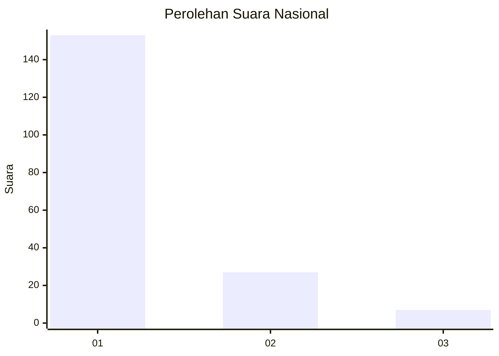
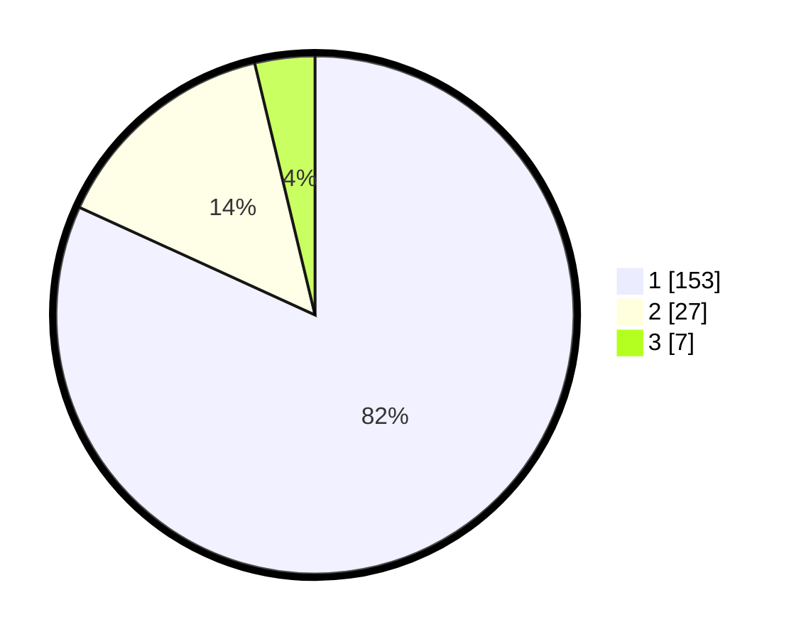

# Hasil

## Grafik

## Tabel

| No. | Nama Paslon    | Suara | Suara (raw) | Persentase |
|:--- |:-------------- | -----:| -----------:| ----------:|
| 1   | ANIES MUHAIMIN | 153   | [153][p-1]  | 81,82      |
| 2   | PRABOWO GIBRAN | 27    | [27][p-2]   | 14,44      |
| 3   | GANJAR MAHFUD  | 7     | [7][p-3]    | 3,74       |

[p-1]: https://github.com/gigit-pemilu/pemilu-2024/blob/main/pilpres/hitung-suara/sub/13-sumatera-barat/sub/71-kota-padang/sub/11-koto-tangah/sub/1010-batang-kabung-ganting/sub/034-tps/sub/paslon-1.txt
[p-2]: https://github.com/gigit-pemilu/pemilu-2024/blob/main/pilpres/hitung-suara/sub/13-sumatera-barat/sub/71-kota-padang/sub/11-koto-tangah/sub/1010-batang-kabung-ganting/sub/034-tps/sub/paslon-2.txt
[p-3]: https://github.com/gigit-pemilu/pemilu-2024/blob/main/pilpres/hitung-suara/sub/13-sumatera-barat/sub/71-kota-padang/sub/11-koto-tangah/sub/1010-batang-kabung-ganting/sub/034-tps/sub/paslon-3.txt

## Foto C Plano

https://sirekap-obj-formc.kpu.go.id/19c1/pemilu/ppwp/13/71/11/10/10/1371111010034-20240214-210150--4563c666-b2a4-4c4a-9659-df7906d11b74.jpg

https://sirekap-obj-formc.kpu.go.id/19c1/pemilu/ppwp/13/71/11/10/10/1371111010034-20240214-210728--a6c52749-52cf-41b7-b029-892e9bb36b26.jpg

https://sirekap-obj-formc.kpu.go.id/19c1/pemilu/ppwp/13/71/11/10/10/1371111010034-20240214-210908--59965153-ce09-482a-a597-c423413794de.jpg

## Metadata

| Key        | Value               |
| ---------- | ------------------- |
| Time Stamp | 2024-02-15 12:00:28 |

