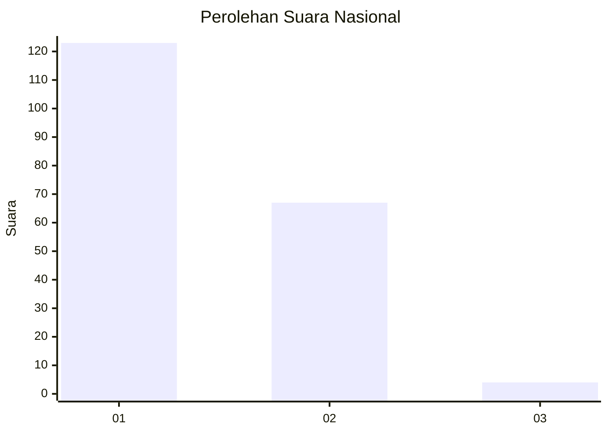
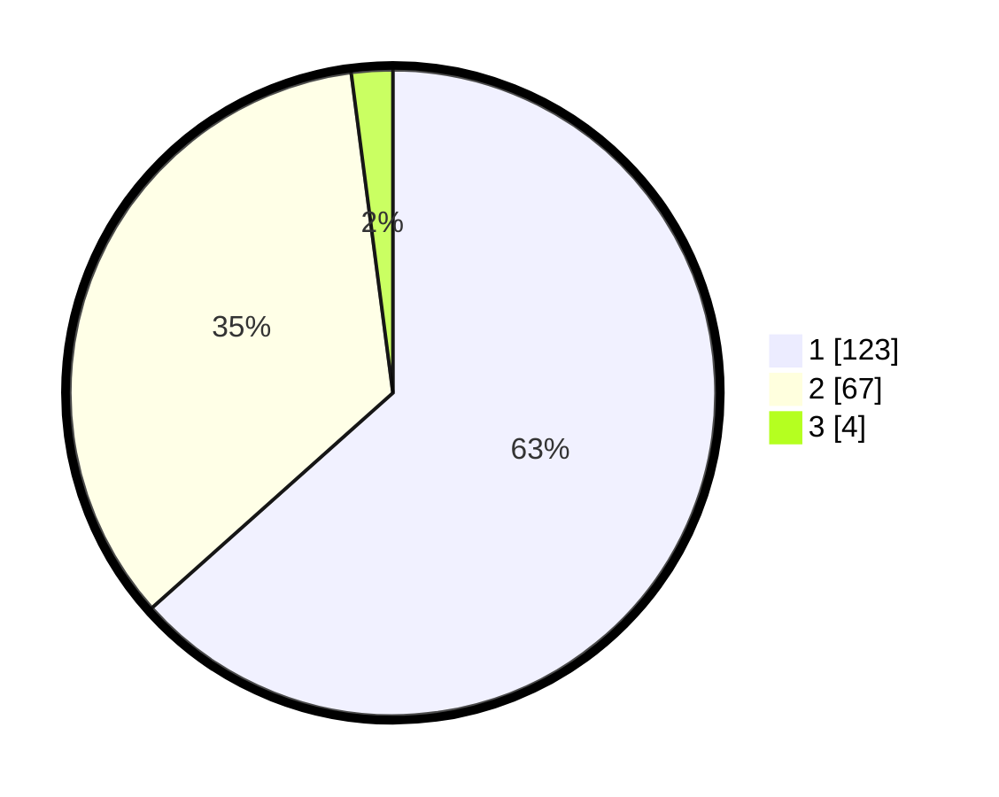

# Hasil

## Grafik

## Tabel

| No. | Nama Paslon    | Suara | Suara (raw) | Persentase |
|:--- |:-------------- | -----:| -----------:| ----------:|
| 1   | ANIES MUHAIMIN | 123   | [123][p-1]  | 63,40      |
| 2   | PRABOWO GIBRAN | 67    | [67][p-2]   | 34,54      |
| 3   | GANJAR MAHFUD  | 4     | [4][p-3]    | 2,06       |

[p-1]: https://github.com/gigit-pemilu/pemilu-2024/blob/main/pilpres/hitung-suara/sub/13-sumatera-barat/sub/71-kota-padang/sub/11-koto-tangah/sub/1012-parupuk-tabing/sub/003-tps/sub/paslon-1.txt
[p-2]: https://github.com/gigit-pemilu/pemilu-2024/blob/main/pilpres/hitung-suara/sub/13-sumatera-barat/sub/71-kota-padang/sub/11-koto-tangah/sub/1012-parupuk-tabing/sub/003-tps/sub/paslon-2.txt
[p-3]: https://github.com/gigit-pemilu/pemilu-2024/blob/main/pilpres/hitung-suara/sub/13-sumatera-barat/sub/71-kota-padang/sub/11-koto-tangah/sub/1012-parupuk-tabing/sub/003-tps/sub/paslon-3.txt

## Foto C Plano

https://sirekap-obj-formc.kpu.go.id/8e6e/pemilu/ppwp/13/71/11/10/12/1371111012003-20240214-225043--5deb99b0-4f73-45c0-aab6-1a221bd38c7b.jpg

https://sirekap-obj-formc.kpu.go.id/8e6e/pemilu/ppwp/13/71/11/10/12/1371111012003-20240218-220727--b07b1596-a030-445c-9a1a-1fba92b1220b.jpg

https://sirekap-obj-formc.kpu.go.id/8e6e/pemilu/ppwp/13/71/11/10/12/1371111012003-20240214-232214--d5d0cde2-b4ee-433b-9d5f-04a3ba357056.jpg

## Metadata

| Key        | Value               |
| ---------- | ------------------- |
| Time Stamp | 2024-02-21 23:00:00 |

