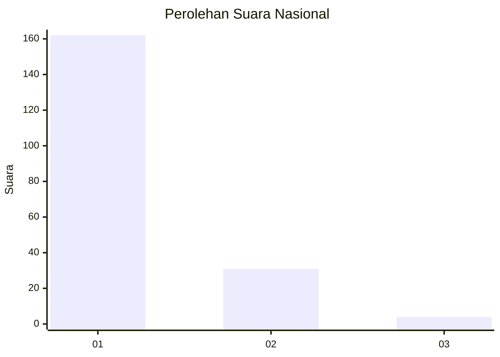
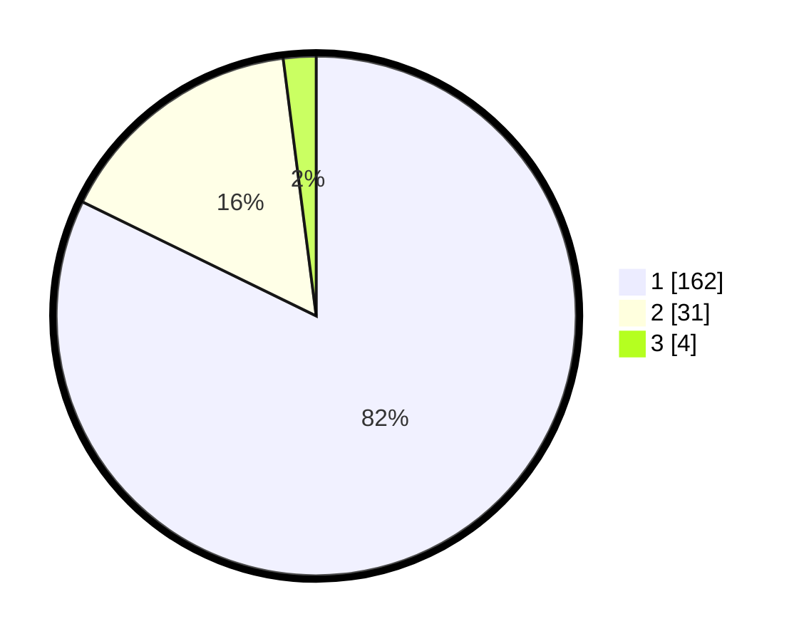

# Hasil

## Grafik

## Tabel

| No. | Nama Paslon    | Suara | Suara (raw) | Persentase |
|:--- |:-------------- | -----:| -----------:| ----------:|
| 1   | ANIES MUHAIMIN | 162   | [162][p-1]  | 82,23      |
| 2   | PRABOWO GIBRAN | 31    | [31][p-2]   | 15,74      |
| 3   | GANJAR MAHFUD  | 4     | [4][p-3]    | 2,03       |

[p-1]: https://github.com/gigit-pemilu/pemilu-2024/blob/main/pilpres/hitung-suara/sub/13-sumatera-barat/sub/72-kota-solok/sub/01-lubuk-sikarah/sub/1001-tanah-garam/sub/005-tps/sub/paslon-1.txt
[p-2]: https://github.com/gigit-pemilu/pemilu-2024/blob/main/pilpres/hitung-suara/sub/13-sumatera-barat/sub/72-kota-solok/sub/01-lubuk-sikarah/sub/1001-tanah-garam/sub/005-tps/sub/paslon-2.txt
[p-3]: https://github.com/gigit-pemilu/pemilu-2024/blob/main/pilpres/hitung-suara/sub/13-sumatera-barat/sub/72-kota-solok/sub/01-lubuk-sikarah/sub/1001-tanah-garam/sub/005-tps/sub/paslon-3.txt

## Foto C Plano

https://sirekap-obj-formc.kpu.go.id/4b2b/pemilu/ppwp/13/72/01/10/01/1372011001005-20240214-231422--dffb6423-fd9c-427b-99b3-de1052e62fc6.jpg

https://sirekap-obj-formc.kpu.go.id/4b2b/pemilu/ppwp/13/72/01/10/01/1372011001005-20240215-025904--95731dfa-41f1-42ca-8944-833b505530b8.jpg

https://sirekap-obj-formc.kpu.go.id/4b2b/pemilu/ppwp/13/72/01/10/01/1372011001005-20240215-030205--9f9ccf9a-a836-4529-86cc-9528c0e2779f.jpg

## Metadata

| Key        | Value               |
| ---------- | ------------------- |
| Time Stamp | 2024-02-26 12:00:00 |

