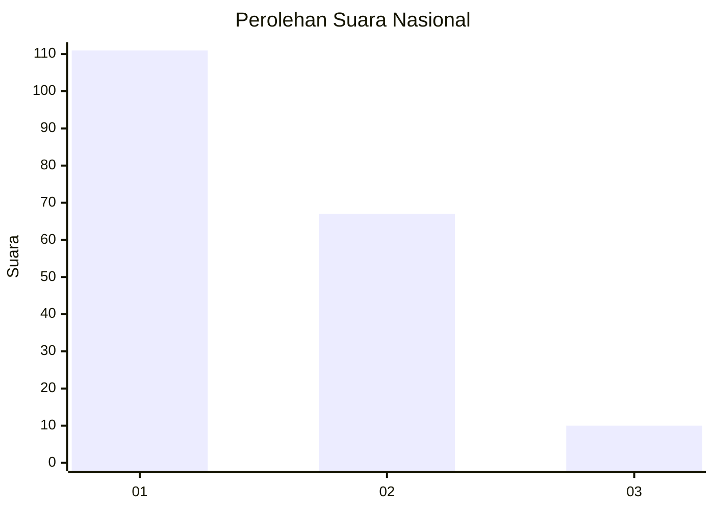
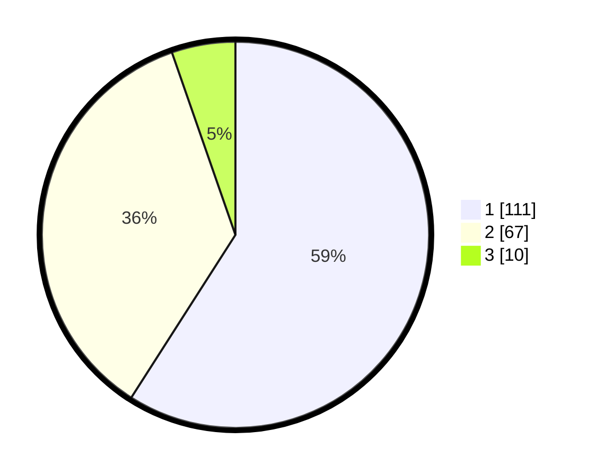

# Hasil

## Grafik

## Tabel

| No. | Nama Paslon    | Suara | Suara (raw) | Persentase |
|:--- |:-------------- | -----:| -----------:| ----------:|
| 1   | ANIES MUHAIMIN | 111   | [111][p-1]  | 59,04      |
| 2   | PRABOWO GIBRAN | 67    | [67][p-2]   | 35,64      |
| 3   | GANJAR MAHFUD  | 10    | [10][p-3]   | 5,32       |

[p-1]: https://github.com/gigit-pemilu/pemilu-2024/blob/main/pilpres/hitung-suara/sub/13-sumatera-barat/sub/74-kota-padang-panjang/sub/01-padang-panjang-timur/sub/1001-ganting/sub/001-tps/sub/paslon-1.txt
[p-2]: https://github.com/gigit-pemilu/pemilu-2024/blob/main/pilpres/hitung-suara/sub/13-sumatera-barat/sub/74-kota-padang-panjang/sub/01-padang-panjang-timur/sub/1001-ganting/sub/001-tps/sub/paslon-2.txt
[p-3]: https://github.com/gigit-pemilu/pemilu-2024/blob/main/pilpres/hitung-suara/sub/13-sumatera-barat/sub/74-kota-padang-panjang/sub/01-padang-panjang-timur/sub/1001-ganting/sub/001-tps/sub/paslon-3.txt

## Foto C Plano

https://sirekap-obj-formc.kpu.go.id/d29e/pemilu/ppwp/13/74/01/10/01/1374011001001-20240214-235432--467b1f2d-ef1f-48c2-b549-e8c9000cff4a.jpg

https://sirekap-obj-formc.kpu.go.id/d29e/pemilu/ppwp/13/74/01/10/01/1374011001001-20240214-235330--391fd75e-487e-49d0-999e-b0cb0dfcb585.jpg

https://sirekap-obj-formc.kpu.go.id/d29e/pemilu/ppwp/13/74/01/10/01/1374011001001-20240214-235411--7cc397c6-067f-4a83-bae9-3c0815dd182f.jpg

## Metadata

| Key        | Value               |
| ---------- | ------------------- |
| Time Stamp | 2024-02-21 00:00:00 |

