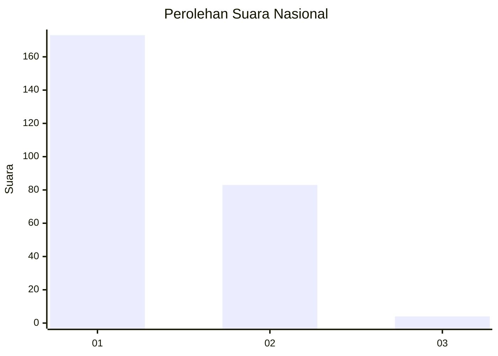
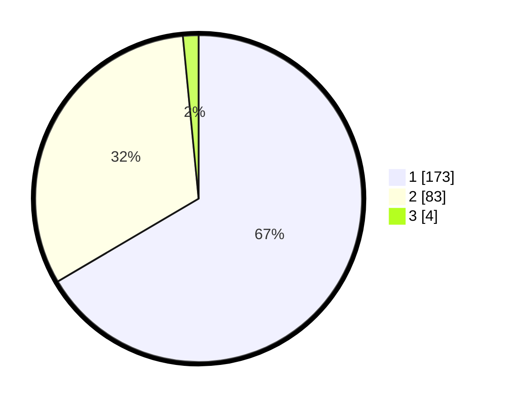

# Hasil

## Grafik

## Tabel

| No. | Nama Paslon    | Suara | Suara (raw) | Persentase |
|:--- |:-------------- | -----:| -----------:| ----------:|
| 1   | ANIES MUHAIMIN | 173   | [173][p-1]  | 66,54      |
| 2   | PRABOWO GIBRAN | 83    | [83][p-2]   | 31,92      |
| 3   | GANJAR MAHFUD  | 4     | [4][p-3]    | 1,54       |

[p-1]: https://github.com/gigit-pemilu/pemilu-2024/blob/main/pilpres/hitung-suara/sub/13-sumatera-barat/sub/74-kota-padang-panjang/sub/02-padang-panjang-barat/sub/1003-kampung-manggis/sub/016-tps/sub/paslon-1.txt
[p-2]: https://github.com/gigit-pemilu/pemilu-2024/blob/main/pilpres/hitung-suara/sub/13-sumatera-barat/sub/74-kota-padang-panjang/sub/02-padang-panjang-barat/sub/1003-kampung-manggis/sub/016-tps/sub/paslon-2.txt
[p-3]: https://github.com/gigit-pemilu/pemilu-2024/blob/main/pilpres/hitung-suara/sub/13-sumatera-barat/sub/74-kota-padang-panjang/sub/02-padang-panjang-barat/sub/1003-kampung-manggis/sub/016-tps/sub/paslon-3.txt

## Foto C Plano

https://sirekap-obj-formc.kpu.go.id/cbc2/pemilu/ppwp/13/74/02/10/03/1374021003016-20240219-150043--c0c42c85-4a98-4ddd-be7b-f9f03460ce41.jpg

https://sirekap-obj-formc.kpu.go.id/cbc2/pemilu/ppwp/13/74/02/10/03/1374021003016-20240219-150059--5094acc1-6add-479e-8130-7859e35a4f48.jpg

https://sirekap-obj-formc.kpu.go.id/cbc2/pemilu/ppwp/13/74/02/10/03/1374021003016-20240219-150116--26685faf-ebc6-4fd8-9953-8d2b64bfb818.jpg

## Metadata

| Key        | Value               |
| ---------- | ------------------- |
| Time Stamp | 2024-02-19 18:00:00 |

