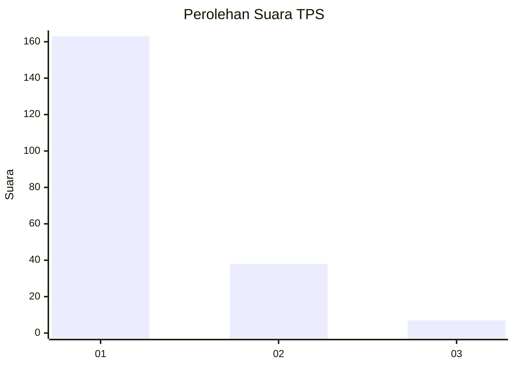
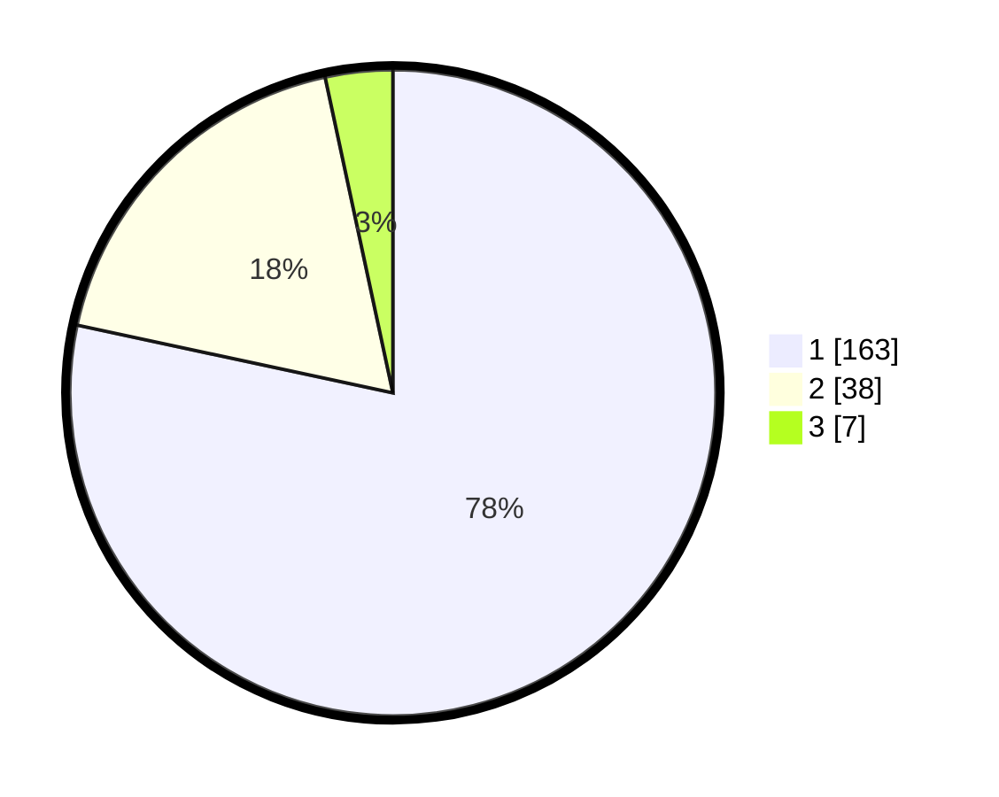

# Hasil

## Grafik

## Tabel

| No. | Nama Paslon    | Suara | Suara (raw) | Persentase |
|:--- |:-------------- | -----:| -----------:| ----------:|
| 1   | ANIES MUHAIMIN | 163   | [163][p-1]  | 78,37      |
| 2   | PRABOWO GIBRAN | 38    | [38][p-2]   | 18,27      |
| 3   | GANJAR MAHFUD  | 7     | [7][p-3]    | 3,37       |

[p-1]: https://github.com/gigit-pemilu/pemilu-2024-13-sumatera-barat/blob/main/pilpres/hitung-suara/sub/13-sumatera-barat/sub/74-kota-padang-panjang/sub/02-padang-panjang-barat/sub/1004-silaing-bawah/sub/004-tps/sub/paslon-1.txt
[p-2]: https://github.com/gigit-pemilu/pemilu-2024-13-sumatera-barat/blob/main/pilpres/hitung-suara/sub/13-sumatera-barat/sub/74-kota-padang-panjang/sub/02-padang-panjang-barat/sub/1004-silaing-bawah/sub/004-tps/sub/paslon-2.txt
[p-3]: https://github.com/gigit-pemilu/pemilu-2024-13-sumatera-barat/blob/main/pilpres/hitung-suara/sub/13-sumatera-barat/sub/74-kota-padang-panjang/sub/02-padang-panjang-barat/sub/1004-silaing-bawah/sub/004-tps/sub/paslon-3.txt

## Foto C Plano

https://sirekap-obj-formc.kpu.go.id/5d5b/pemilu/ppwp/13/74/02/10/04/1374021004004-20240214-215029--ab3c7fce-61de-4206-9740-4ccf973b551d.jpg

https://sirekap-obj-formc.kpu.go.id/5d5b/pemilu/ppwp/13/74/02/10/04/1374021004004-20240214-215203--f10e4896-f911-4194-b8e6-16c97469eb0e.jpg

https://sirekap-obj-formc.kpu.go.id/5d5b/pemilu/ppwp/13/74/02/10/04/1374021004004-20240214-215429--f2962161-80e3-4a98-bf07-3257408838c5.jpg

## Metadata

| Key        | Value               |
| ---------- | ------------------- |
| Time Stamp | 2024-02-15 20:30:46 |

