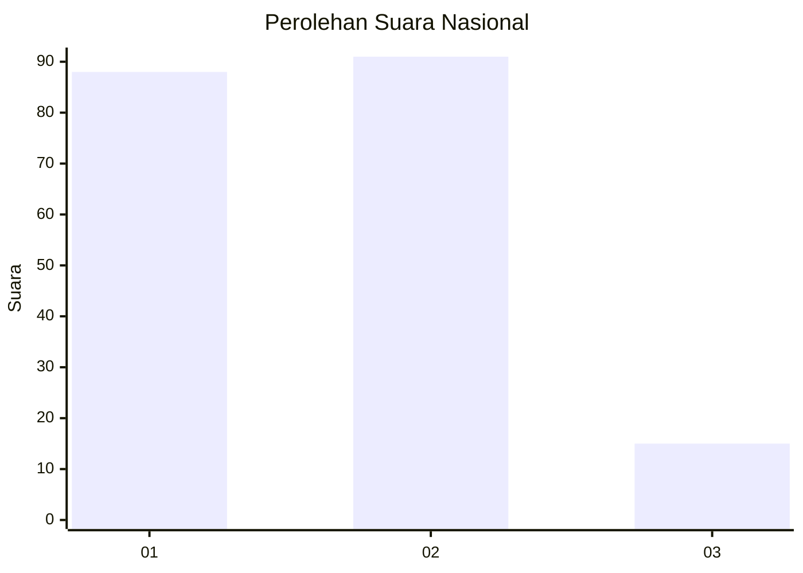
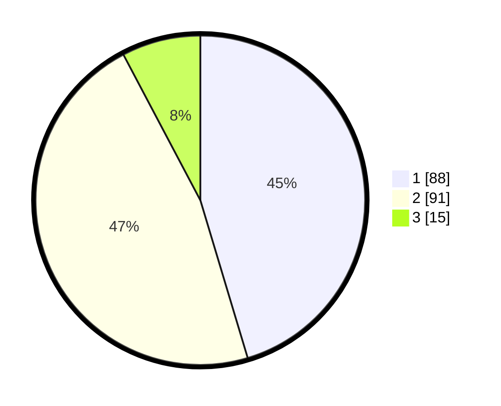

# Hasil

## Grafik

## Tabel

| No. | Nama Paslon    | Suara | Suara (raw) | Persentase |
|:--- |:-------------- | -----:| -----------:| ----------:|
| 1   | ANIES MUHAIMIN | 88    | [88][p-1]   | 45,36      |
| 2   | PRABOWO GIBRAN | 91    | [91][p-2]   | 46,91      |
| 3   | GANJAR MAHFUD  | 15    | [15][p-3]   | 7,73       |

[p-1]: https://github.com/gigit-pemilu/pemilu-2024/blob/main/pilpres/hitung-suara/sub/13-sumatera-barat/sub/75-kota-bukittinggi/sub/01-guguak-panjang/sub/1001-tarok-dipo/sub/001-tps/sub/paslon-1.txt
[p-2]: https://github.com/gigit-pemilu/pemilu-2024/blob/main/pilpres/hitung-suara/sub/13-sumatera-barat/sub/75-kota-bukittinggi/sub/01-guguak-panjang/sub/1001-tarok-dipo/sub/001-tps/sub/paslon-2.txt
[p-3]: https://github.com/gigit-pemilu/pemilu-2024/blob/main/pilpres/hitung-suara/sub/13-sumatera-barat/sub/75-kota-bukittinggi/sub/01-guguak-panjang/sub/1001-tarok-dipo/sub/001-tps/sub/paslon-3.txt

## Foto C Plano

https://sirekap-obj-formc.kpu.go.id/02b7/pemilu/ppwp/13/75/01/10/01/1375011001001-20240214-191424--dd17d194-e3de-4adb-93af-75527ca487fb.jpg

https://sirekap-obj-formc.kpu.go.id/02b7/pemilu/ppwp/13/75/01/10/01/1375011001001-20240214-191543--39e1a1a0-5dc5-494f-88fd-319a8fd330ec.jpg

https://sirekap-obj-formc.kpu.go.id/02b7/pemilu/ppwp/13/75/01/10/01/1375011001001-20240214-191654--97860ca3-73b6-426f-910d-7820aea48d3f.jpg

## Metadata

| Key        | Value               |
| ---------- | ------------------- |
| Time Stamp | 2024-02-19 23:00:00 |

