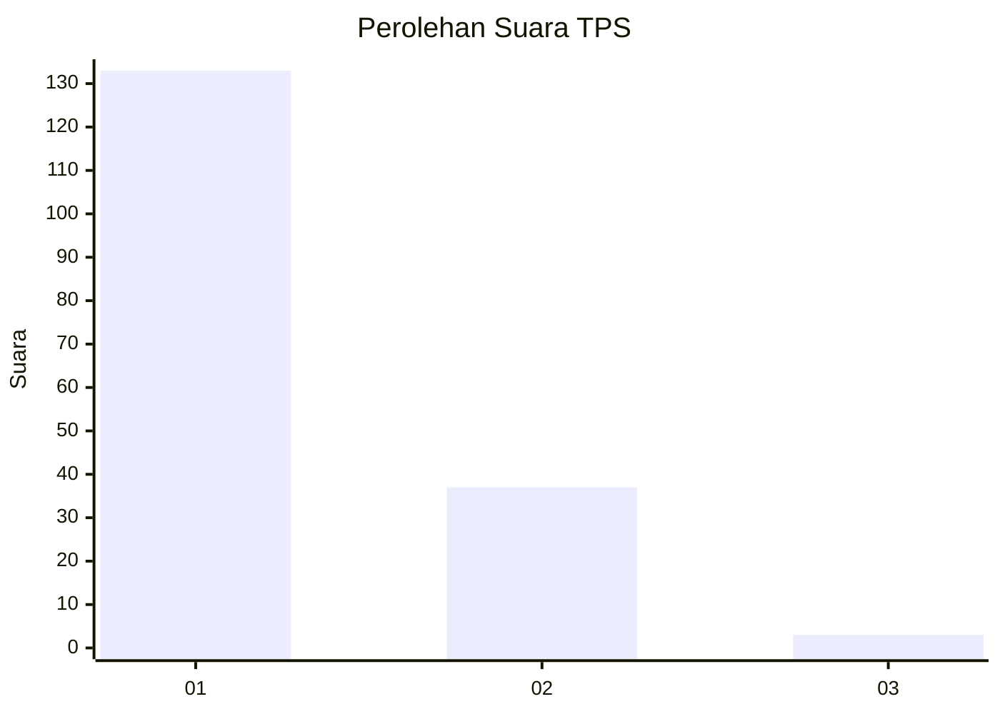
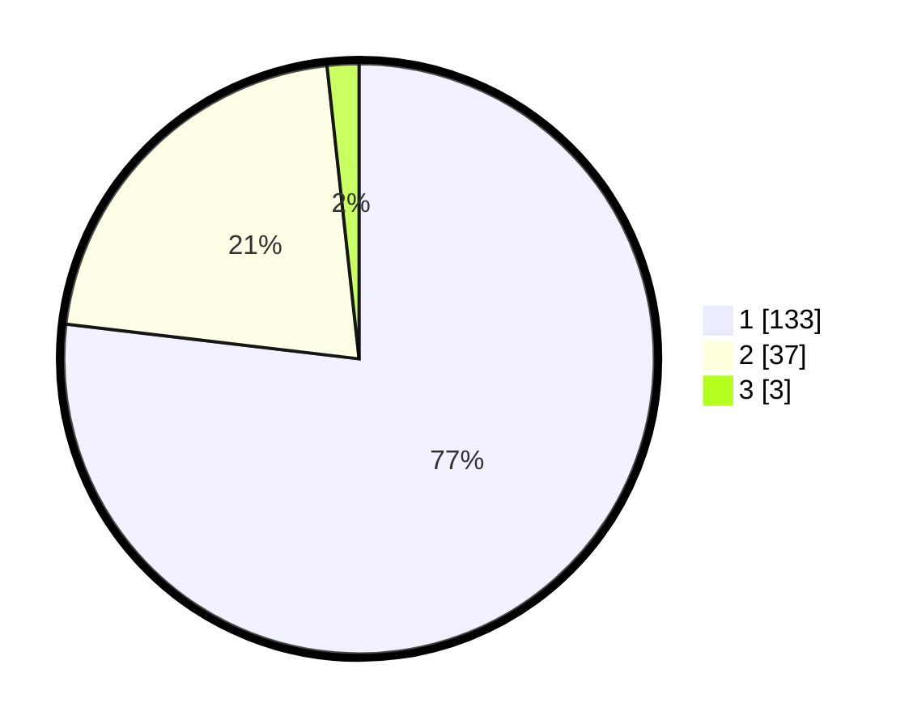

# Hasil

## Grafik

## Tabel

| No. | Nama Paslon    | Suara | Suara (raw) | Persentase |
|:--- |:-------------- | -----:| -----------:| ----------:|
| 1   | ANIES MUHAIMIN | 133   | [133][p-1]  | 76,88      |
| 2   | PRABOWO GIBRAN | 37    | [37][p-2]   | 21,39      |
| 3   | GANJAR MAHFUD  | 3     | [3][p-3]    | 1,73       |

[p-1]: https://github.com/gigit-pemilu/pemilu-2024-13-sumatera-barat/blob/main/pilpres/hitung-suara/sub/13-sumatera-barat/sub/75-kota-bukittinggi/sub/02-mandiangin-k-selayan/sub/1006-pulai-anak-air/sub/006-tps/sub/paslon-1.txt
[p-2]: https://github.com/gigit-pemilu/pemilu-2024-13-sumatera-barat/blob/main/pilpres/hitung-suara/sub/13-sumatera-barat/sub/75-kota-bukittinggi/sub/02-mandiangin-k-selayan/sub/1006-pulai-anak-air/sub/006-tps/sub/paslon-2.txt
[p-3]: https://github.com/gigit-pemilu/pemilu-2024-13-sumatera-barat/blob/main/pilpres/hitung-suara/sub/13-sumatera-barat/sub/75-kota-bukittinggi/sub/02-mandiangin-k-selayan/sub/1006-pulai-anak-air/sub/006-tps/sub/paslon-3.txt

## Foto C Plano

https://sirekap-obj-formc.kpu.go.id/fc51/pemilu/ppwp/13/75/02/10/06/1375021006006-20240214-231859--c6d50c52-727a-4b13-afe3-fbcbba9a82e1.jpg

https://sirekap-obj-formc.kpu.go.id/fc51/pemilu/ppwp/13/75/02/10/06/1375021006006-20240214-232034--941d9425-863a-4f66-8e5e-2d3e99abcfcb.jpg

https://sirekap-obj-formc.kpu.go.id/fc51/pemilu/ppwp/13/75/02/10/06/1375021006006-20240214-232131--4f7a1c6c-9040-483b-b8b1-532e3da1d0a7.jpg

## Metadata

| Key        | Value               |
| ---------- | ------------------- |
| Time Stamp | 2024-02-15 17:00:25 |

