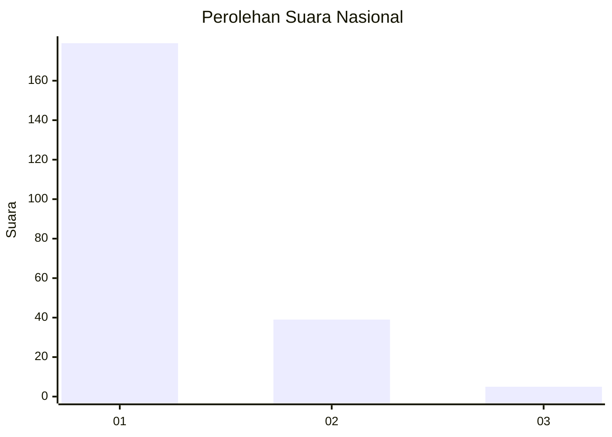
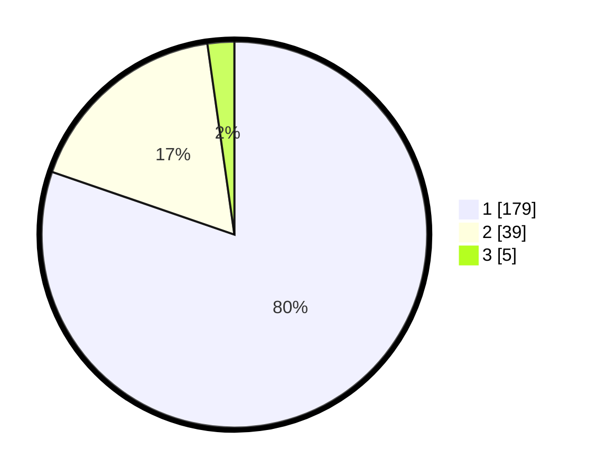

# Hasil

## Grafik

## Tabel

| No. | Nama Paslon    | Suara | Suara (raw) | Persentase |
|:--- |:-------------- | -----:| -----------:| ----------:|
| 1   | ANIES MUHAIMIN | 179   | [179][p-1]  | 80,27      |
| 2   | PRABOWO GIBRAN | 39    | [39][p-2]   | 17,49      |
| 3   | GANJAR MAHFUD  | 5     | [5][p-3]    | 2,24       |

[p-1]: https://github.com/gigit-pemilu/pemilu-2024/blob/main/pilpres/hitung-suara/sub/13-sumatera-barat/sub/75-kota-bukittinggi/sub/02-mandiangin-k-selayan/sub/1008-garegeh/sub/005-tps/sub/paslon-1.txt
[p-2]: https://github.com/gigit-pemilu/pemilu-2024/blob/main/pilpres/hitung-suara/sub/13-sumatera-barat/sub/75-kota-bukittinggi/sub/02-mandiangin-k-selayan/sub/1008-garegeh/sub/005-tps/sub/paslon-2.txt
[p-3]: https://github.com/gigit-pemilu/pemilu-2024/blob/main/pilpres/hitung-suara/sub/13-sumatera-barat/sub/75-kota-bukittinggi/sub/02-mandiangin-k-selayan/sub/1008-garegeh/sub/005-tps/sub/paslon-3.txt

## Foto C Plano

https://sirekap-obj-formc.kpu.go.id/c7bc/pemilu/ppwp/13/75/02/10/08/1375021008005-20240215-001053--26f61f9a-6abf-48f9-a481-bc427e593694.jpg

https://sirekap-obj-formc.kpu.go.id/c7bc/pemilu/ppwp/13/75/02/10/08/1375021008005-20240215-001226--6e4f223b-95b5-4170-bce7-fbebead24566.jpg

https://sirekap-obj-formc.kpu.go.id/c7bc/pemilu/ppwp/13/75/02/10/08/1375021008005-20240215-001224--2167352f-8e27-4a67-a077-a7108822ba9c.jpg

## Metadata

| Key        | Value               |
| ---------- | ------------------- |
| Time Stamp | 2024-02-15 12:00:28 |

