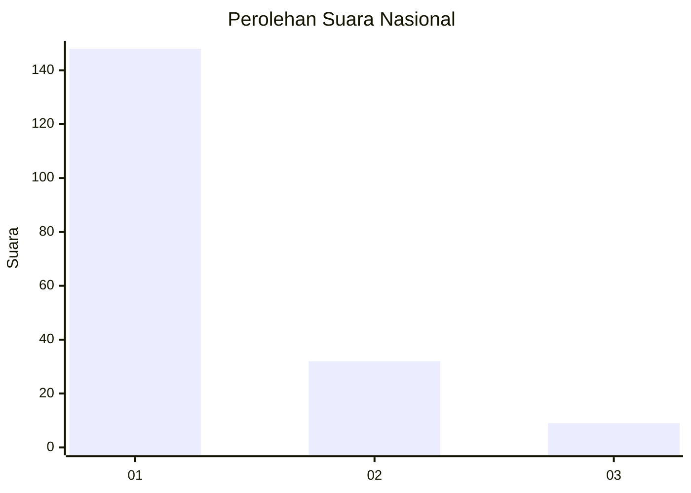
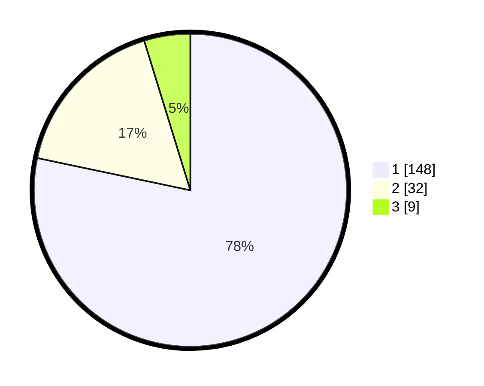

# Hasil

## Grafik

## Tabel

| No. | Nama Paslon    | Suara | Suara (raw) | Persentase |
|:--- |:-------------- | -----:| -----------:| ----------:|
| 1   | ANIES MUHAIMIN | 148   | [148][p-1]  | 78,31      |
| 2   | PRABOWO GIBRAN | 32    | [32][p-2]   | 16,93      |
| 3   | GANJAR MAHFUD  | 9     | [9][p-3]    | 4,76       |

[p-1]: https://github.com/gigit-pemilu/pemilu-2024/blob/main/pilpres/hitung-suara/sub/13-sumatera-barat/sub/75-kota-bukittinggi/sub/03-aur-birugo-tigo-baleh/sub/1002-birugo/sub/005-tps/sub/paslon-1.txt
[p-2]: https://github.com/gigit-pemilu/pemilu-2024/blob/main/pilpres/hitung-suara/sub/13-sumatera-barat/sub/75-kota-bukittinggi/sub/03-aur-birugo-tigo-baleh/sub/1002-birugo/sub/005-tps/sub/paslon-2.txt
[p-3]: https://github.com/gigit-pemilu/pemilu-2024/blob/main/pilpres/hitung-suara/sub/13-sumatera-barat/sub/75-kota-bukittinggi/sub/03-aur-birugo-tigo-baleh/sub/1002-birugo/sub/005-tps/sub/paslon-3.txt

## Foto C Plano

https://sirekap-obj-formc.kpu.go.id/a962/pemilu/ppwp/13/75/03/10/02/1375031002005-20240225-131813--6ef8d744-1b83-4f7a-8927-c41e289fec7c.jpg

https://sirekap-obj-formc.kpu.go.id/a962/pemilu/ppwp/13/75/03/10/02/1375031002005-20240225-132012--a9e6d5bb-366b-4b46-866d-ff96e7144cbc.jpg

https://sirekap-obj-formc.kpu.go.id/a962/pemilu/ppwp/13/75/03/10/02/1375031002005-20240225-132231--aedfc43f-c647-43a4-ad5d-2836d5693721.jpg

## Metadata

| Key        | Value               |
| ---------- | ------------------- |
| Time Stamp | 2024-02-25 14:00:00 |

