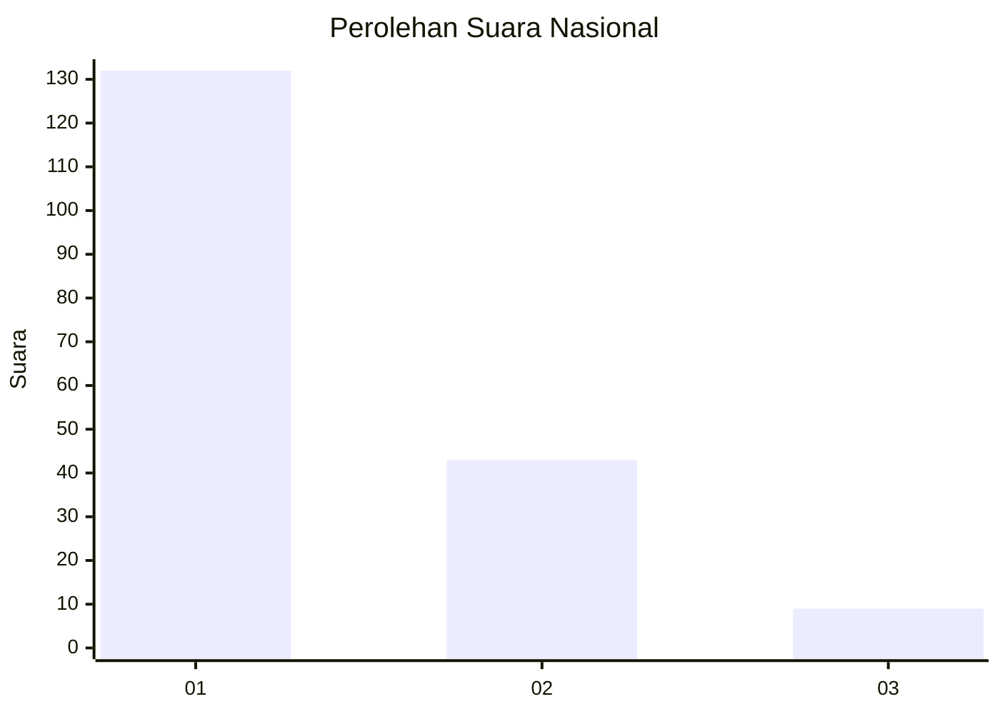
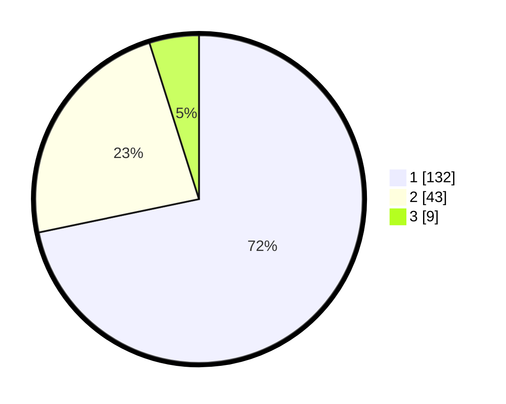

# Hasil

## Grafik

## Tabel

| No. | Nama Paslon    | Suara | Suara (raw) | Persentase |
|:--- |:-------------- | -----:| -----------:| ----------:|
| 1   | ANIES MUHAIMIN | 132   | [132][p-1]  | 71,74      |
| 2   | PRABOWO GIBRAN | 43    | [43][p-2]   | 23,37      |
| 3   | GANJAR MAHFUD  | 9     | [9][p-3]    | 4,89       |

[p-1]: https://github.com/gigit-pemilu/pemilu-2024/blob/main/pilpres/hitung-suara/sub/13-sumatera-barat/sub/76-kota-payakumbuh/sub/01-payakumbuh-barat/sub/1002-pakan-sinayan/sub/004-tps/sub/paslon-1.txt
[p-2]: https://github.com/gigit-pemilu/pemilu-2024/blob/main/pilpres/hitung-suara/sub/13-sumatera-barat/sub/76-kota-payakumbuh/sub/01-payakumbuh-barat/sub/1002-pakan-sinayan/sub/004-tps/sub/paslon-2.txt
[p-3]: https://github.com/gigit-pemilu/pemilu-2024/blob/main/pilpres/hitung-suara/sub/13-sumatera-barat/sub/76-kota-payakumbuh/sub/01-payakumbuh-barat/sub/1002-pakan-sinayan/sub/004-tps/sub/paslon-3.txt

## Foto C Plano

https://sirekap-obj-formc.kpu.go.id/2a31/pemilu/ppwp/13/76/01/10/02/1376011002004-20240217-203140--c9c31ecc-382a-45e3-b908-698ca6722301.jpg

https://sirekap-obj-formc.kpu.go.id/2a31/pemilu/ppwp/13/76/01/10/02/1376011002004-20240217-203142--03aefc71-43cc-471a-a800-72bd06996419.jpg

https://sirekap-obj-formc.kpu.go.id/2a31/pemilu/ppwp/13/76/01/10/02/1376011002004-20240217-203141--67c7c602-53be-4aaa-8e51-90144a29148c.jpg

## Metadata

| Key        | Value               |
| ---------- | ------------------- |
| Time Stamp | 2024-02-19 06:16:00 |

## DATA PEMILIH TETAP

Jumlah pemilih dalam DPT: **255**.
 * L: **124**.
 * P: **131**.

## DATA PENGGUNA HAK PILIH

Jumlah pengguna hak pilih dalam DPT: **187**.
 * L: **87**.
 * P: **100**.

Jumlah pengguna hak pilih dalam DPTb: **0**.
 * L: **0**.
 * P: **0**.

Jumlah pengguna hak pilih dalam DPK: **1**.
 * L: **0**.
 * P: **1**.

Jumlah pengguna hak pilih: **188**.
 * L: **87**.
 * P: **101**.

## JUMLAH SUARA SAH DAN TIDAK SAH

JUMLAH SELURUH SUARA SAH: **184**.

JUMLAH SUARA TIDAK SAH: **4**.

JUMLAH SELURUH SUARA SAH DAN SUARA TIDAK SAH: **188**.

