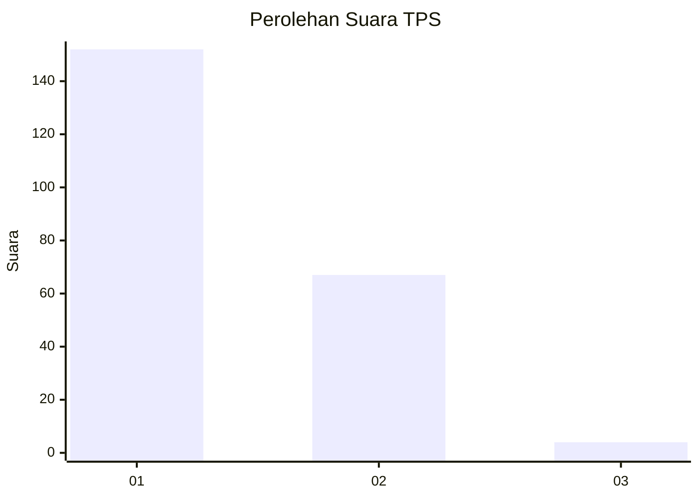
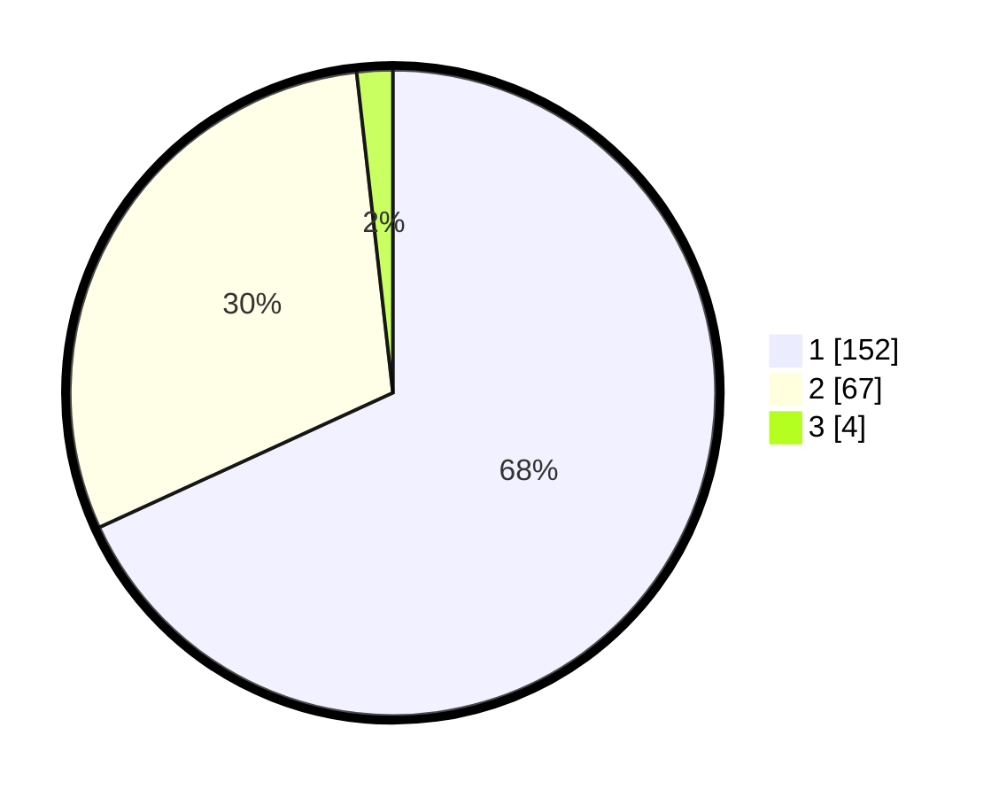

# Hasil

## Grafik

## Tabel

| No. | Nama Paslon    | Suara | Suara (raw) | Persentase |
|:--- |:-------------- | -----:| -----------:| ----------:|
| 1   | ANIES MUHAIMIN | 152   | [152][p-1]  | 68,16      |
| 2   | PRABOWO GIBRAN | 67    | [67][p-2]   | 30,04      |
| 3   | GANJAR MAHFUD  | 4     | [4][p-3]    | 1,79       |

[p-1]: https://github.com/gigit-pemilu/pemilu-2024-13-sumatera-barat/blob/main/pilpres/hitung-suara/sub/13-sumatera-barat/sub/76-kota-payakumbuh/sub/01-payakumbuh-barat/sub/1011-koto-tangah/sub/004-tps/sub/paslon-1.txt
[p-2]: https://github.com/gigit-pemilu/pemilu-2024-13-sumatera-barat/blob/main/pilpres/hitung-suara/sub/13-sumatera-barat/sub/76-kota-payakumbuh/sub/01-payakumbuh-barat/sub/1011-koto-tangah/sub/004-tps/sub/paslon-2.txt
[p-3]: https://github.com/gigit-pemilu/pemilu-2024-13-sumatera-barat/blob/main/pilpres/hitung-suara/sub/13-sumatera-barat/sub/76-kota-payakumbuh/sub/01-payakumbuh-barat/sub/1011-koto-tangah/sub/004-tps/sub/paslon-3.txt

## Foto C Plano

https://sirekap-obj-formc.kpu.go.id/7340/pemilu/ppwp/13/76/01/10/11/1376011011004-20240215-035300--bd7a8e52-6eec-45b5-a0a4-a8ffc6ad370c.jpg

https://sirekap-obj-formc.kpu.go.id/7340/pemilu/ppwp/13/76/01/10/11/1376011011004-20240215-035357--adeca05b-013d-43e6-bb90-8a2d9641d02f.jpg

https://sirekap-obj-formc.kpu.go.id/7340/pemilu/ppwp/13/76/01/10/11/1376011011004-20240215-035528--70a3d6af-c85e-405b-ac70-bf65cb7c220e.jpg

## Metadata

| Key        | Value               |
| ---------- | ------------------- |
| Time Stamp | 2024-02-15 12:00:28 |

