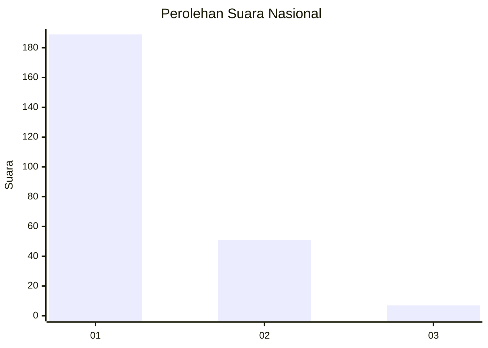
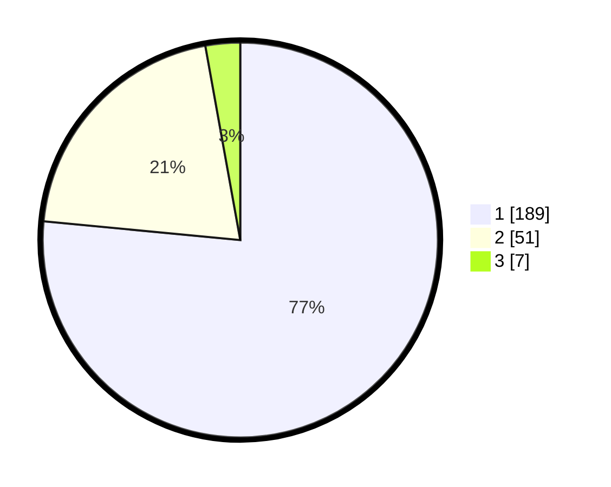

# Hasil

## Grafik

## Tabel

| No. | Nama Paslon    | Suara | Suara (raw) | Persentase |
|:--- |:-------------- | -----:| -----------:| ----------:|
| 1   | ANIES MUHAIMIN | 189   | [189][p-1]  | 76,52      |
| 2   | PRABOWO GIBRAN | 51    | [51][p-2]   | 20,65      |
| 3   | GANJAR MAHFUD  | 7     | [7][p-3]    | 2,83       |

[p-1]: https://github.com/gigit-pemilu/pemilu-2024/blob/main/pilpres/hitung-suara/sub/13-sumatera-barat/sub/76-kota-payakumbuh/sub/02-payakumbuh-utara/sub/1032-ompang-tanah-sirah/sub/004-tps/sub/paslon-1.txt
[p-2]: https://github.com/gigit-pemilu/pemilu-2024/blob/main/pilpres/hitung-suara/sub/13-sumatera-barat/sub/76-kota-payakumbuh/sub/02-payakumbuh-utara/sub/1032-ompang-tanah-sirah/sub/004-tps/sub/paslon-2.txt
[p-3]: https://github.com/gigit-pemilu/pemilu-2024/blob/main/pilpres/hitung-suara/sub/13-sumatera-barat/sub/76-kota-payakumbuh/sub/02-payakumbuh-utara/sub/1032-ompang-tanah-sirah/sub/004-tps/sub/paslon-3.txt

## Foto C Plano

https://sirekap-obj-formc.kpu.go.id/7abc/pemilu/ppwp/13/76/02/10/32/1376021032004-20240214-214548--e2cdbebf-61f4-40d8-952b-fc7e1e4a954a.jpg

https://sirekap-obj-formc.kpu.go.id/7abc/pemilu/ppwp/13/76/02/10/32/1376021032004-20240214-214745--f0b6b8ca-a321-4a8b-b4ff-13f4ba451986.jpg

https://sirekap-obj-formc.kpu.go.id/7abc/pemilu/ppwp/13/76/02/10/32/1376021032004-20240214-214952--0a166fea-1b15-42ed-8667-d18344be9402.jpg

## Metadata

| Key        | Value               |
| ---------- | ------------------- |
| Time Stamp | 2024-02-15 12:00:28 |

