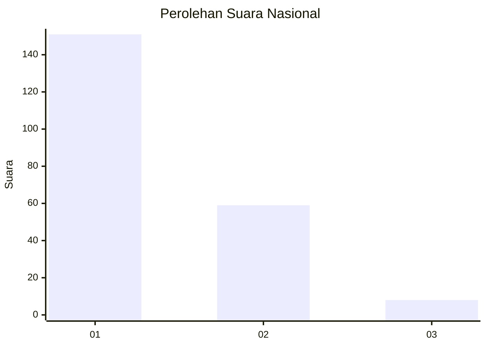
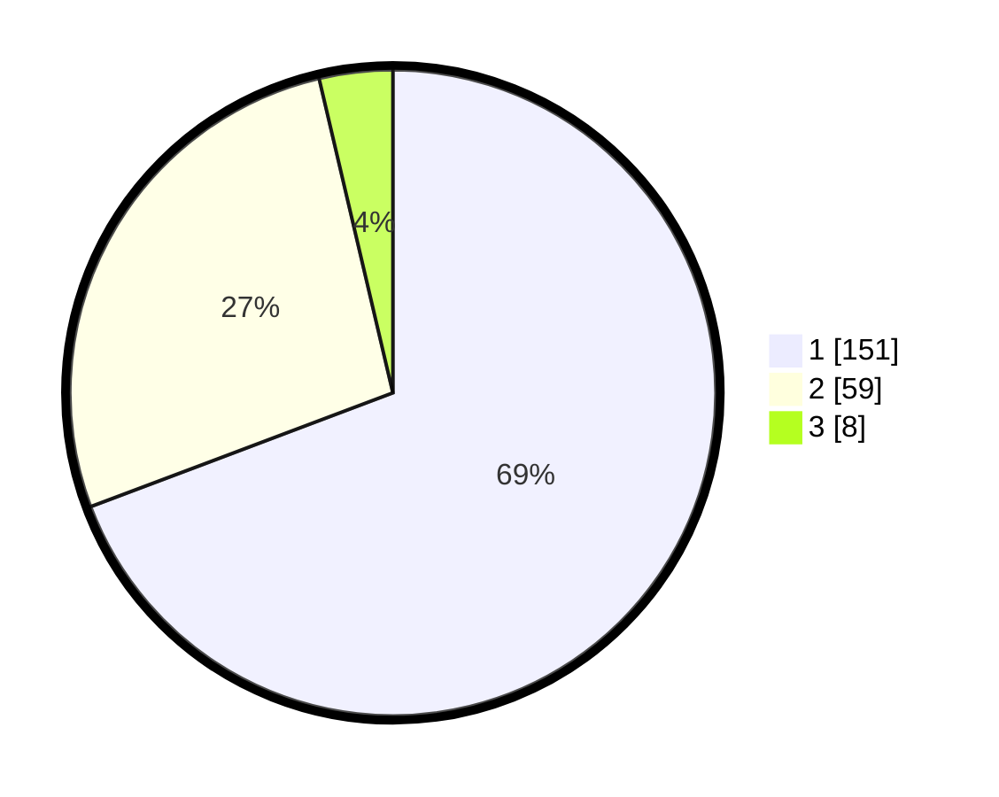

# Hasil

## Grafik

## Tabel

| No. | Nama Paslon    | Suara | Suara (raw) | Persentase |
|:--- |:-------------- | -----:| -----------:| ----------:|
| 1   | ANIES MUHAIMIN | 151   | [151][p-1]  | 69,27      |
| 2   | PRABOWO GIBRAN | 59    | [59][p-2]   | 27,06      |
| 3   | GANJAR MAHFUD  | 8     | [8][p-3]    | 3,67       |

[p-1]: https://github.com/gigit-pemilu/pemilu-2024/blob/main/pilpres/hitung-suara/sub/13-sumatera-barat/sub/77-kota-pariaman/sub/01-pariaman-tengah/sub/1006-pondok-ii/sub/001-tps/sub/paslon-1.txt
[p-2]: https://github.com/gigit-pemilu/pemilu-2024/blob/main/pilpres/hitung-suara/sub/13-sumatera-barat/sub/77-kota-pariaman/sub/01-pariaman-tengah/sub/1006-pondok-ii/sub/001-tps/sub/paslon-2.txt
[p-3]: https://github.com/gigit-pemilu/pemilu-2024/blob/main/pilpres/hitung-suara/sub/13-sumatera-barat/sub/77-kota-pariaman/sub/01-pariaman-tengah/sub/1006-pondok-ii/sub/001-tps/sub/paslon-3.txt

## Foto C Plano

https://sirekap-obj-formc.kpu.go.id/43b0/pemilu/ppwp/13/77/01/10/06/1377011006001-20240219-173819--837697a3-7aac-4d1b-baa6-69d2e8688ec2.jpg

https://sirekap-obj-formc.kpu.go.id/43b0/pemilu/ppwp/13/77/01/10/06/1377011006001-20240215-064143--c2e10b0a-0eb0-489e-b018-736f654cf587.jpg

https://sirekap-obj-formc.kpu.go.id/43b0/pemilu/ppwp/13/77/01/10/06/1377011006001-20240215-064302--9de4fe85-cf16-4503-83e9-cf3196efd492.jpg

## Metadata

| Key        | Value               |
| ---------- | ------------------- |
| Time Stamp | 2024-02-19 18:00:00 |

