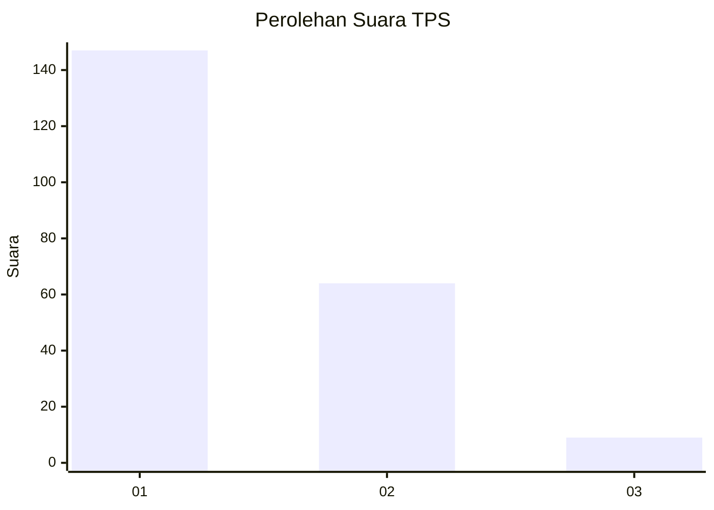
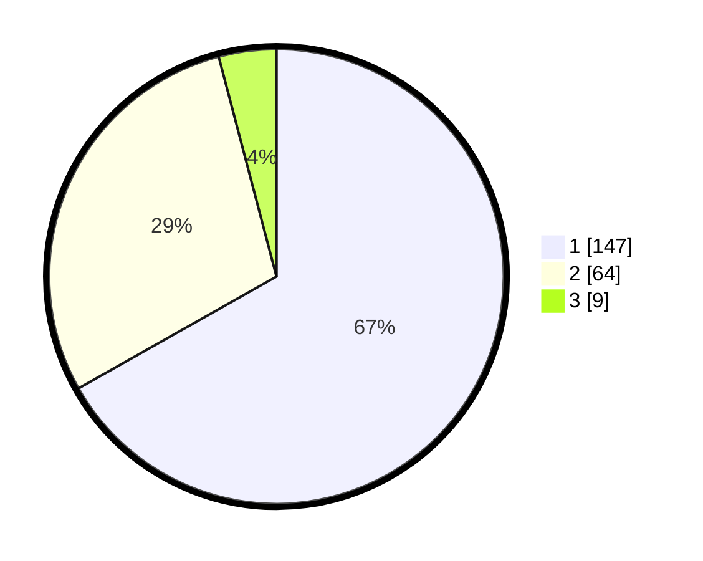

# Hasil

## Grafik

## Tabel

| No. | Nama Paslon    | Suara | Suara (raw) | Persentase |
|:--- |:-------------- | -----:| -----------:| ----------:|
| 1   | ANIES MUHAIMIN | 147   | [147][p-1]  | 66,82      |
| 2   | PRABOWO GIBRAN | 64    | [64][p-2]   | 29,09      |
| 3   | GANJAR MAHFUD  | 9     | [9][p-3]    | 4,09       |

[p-1]: https://github.com/gigit-pemilu/pemilu-2024-13-sumatera-barat/blob/main/pilpres/hitung-suara/sub/13-sumatera-barat/sub/77-kota-pariaman/sub/01-pariaman-tengah/sub/1006-pondok-ii/sub/003-tps/sub/paslon-1.txt
[p-2]: https://github.com/gigit-pemilu/pemilu-2024-13-sumatera-barat/blob/main/pilpres/hitung-suara/sub/13-sumatera-barat/sub/77-kota-pariaman/sub/01-pariaman-tengah/sub/1006-pondok-ii/sub/003-tps/sub/paslon-2.txt
[p-3]: https://github.com/gigit-pemilu/pemilu-2024-13-sumatera-barat/blob/main/pilpres/hitung-suara/sub/13-sumatera-barat/sub/77-kota-pariaman/sub/01-pariaman-tengah/sub/1006-pondok-ii/sub/003-tps/sub/paslon-3.txt

## Foto C Plano

https://sirekap-obj-formc.kpu.go.id/9a4f/pemilu/ppwp/13/77/01/10/06/1377011006003-20240214-210311--83ae0319-5268-4df1-bb17-e5b30b4d31ad.jpg

https://sirekap-obj-formc.kpu.go.id/9a4f/pemilu/ppwp/13/77/01/10/06/1377011006003-20240214-212247--4b094c73-8210-4452-8445-ee8746e1c3fb.jpg

https://sirekap-obj-formc.kpu.go.id/9a4f/pemilu/ppwp/13/77/01/10/06/1377011006003-20240214-213707--58334580-2bb8-4641-aadb-3dc102c52218.jpg

## Metadata

| Key        | Value               |
| ---------- | ------------------- |
| Time Stamp | 2024-02-16 10:00:28 |

