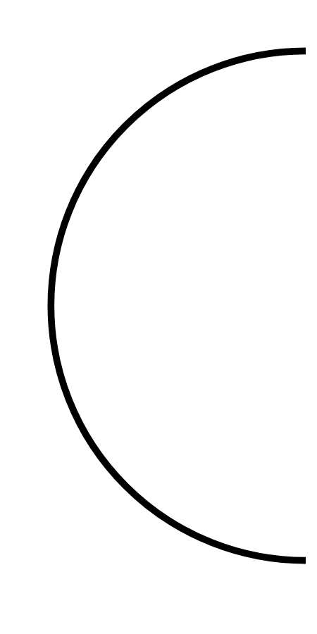

# Hasil

## Grafik

```mermaid
xychart-beta
    title "Perolehan Suara Nasional"
    x-axis []
    y-axis "Suara" 0 --> 0
    bar []
```



## Tabel

| No. | Nama Paslon | Suara | Suara (raw) | Persentase |
|:--- |:----------- | -----:| -----------:| ----------:|


[p-1]: https://github.com/gigit-pemilu/pemilu-2024/blob/main/pilpres/hitung-suara/sub/13-sumatera-barat/sub/77-kota-pariaman/sub/01-pariaman-tengah/sub/1013-taratak/sub/003-tps/sub/paslon-1.txt
[p-2]: https://github.com/gigit-pemilu/pemilu-2024/blob/main/pilpres/hitung-suara/sub/13-sumatera-barat/sub/77-kota-pariaman/sub/01-pariaman-tengah/sub/1013-taratak/sub/003-tps/sub/paslon-2.txt
[p-3]: https://github.com/gigit-pemilu/pemilu-2024/blob/main/pilpres/hitung-suara/sub/13-sumatera-barat/sub/77-kota-pariaman/sub/01-pariaman-tengah/sub/1013-taratak/sub/003-tps/sub/paslon-3.txt

## Foto C Plano

https://sirekap-obj-formc.kpu.go.id/32f8/pemilu/ppwp/13/77/01/10/13/1377011013003-20240222-210956--3bf79e77-ea04-4026-b238-a76f61bd5691.jpg

https://sirekap-obj-formc.kpu.go.id/32f8/pemilu/ppwp/13/77/01/10/13/1377011013003-20240222-211848--76805a6b-3378-4796-9ded-6cf07f78d06e.jpg

https://sirekap-obj-formc.kpu.go.id/32f8/pemilu/ppwp/13/77/01/10/13/1377011013003-20240215-001922--aed04f79-e215-4680-aff8-6c2aa52aadd0.jpg


## Metadata

| Key        | Value               |
| ---------- | ------------------- |
| Time Stamp | 2024-02-22 22:00:00 |


## DATA PEMILIH TETAP

Jumlah pemilih dalam DPT: **273**.
 * L: **578**.
 * P: **405**.

## DATA PENGGUNA HAK PILIH

Jumlah pengguna hak pilih dalam DPT: **170**.
 * L: **508**.
 * P: **85**.

Jumlah pengguna hak pilih dalam DPTb: **81**.
 * L: **884**.
 * P: **880**.

Jumlah pengguna hak pilih dalam DPK: **2**.
 * L: **7**.
 * P: **807**.

Jumlah pengguna hak pilih: **175**.
 * L: **89**.
 * P: **86**.

## JUMLAH SUARA SAH DAN TIDAK SAH

JUMLAH SELURUH SUARA SAH: **171**.

JUMLAH SUARA TIDAK SAH: **4**.

JUMLAH SELURUH SUARA SAH DAN SUARA TIDAK SAH: **175**.


