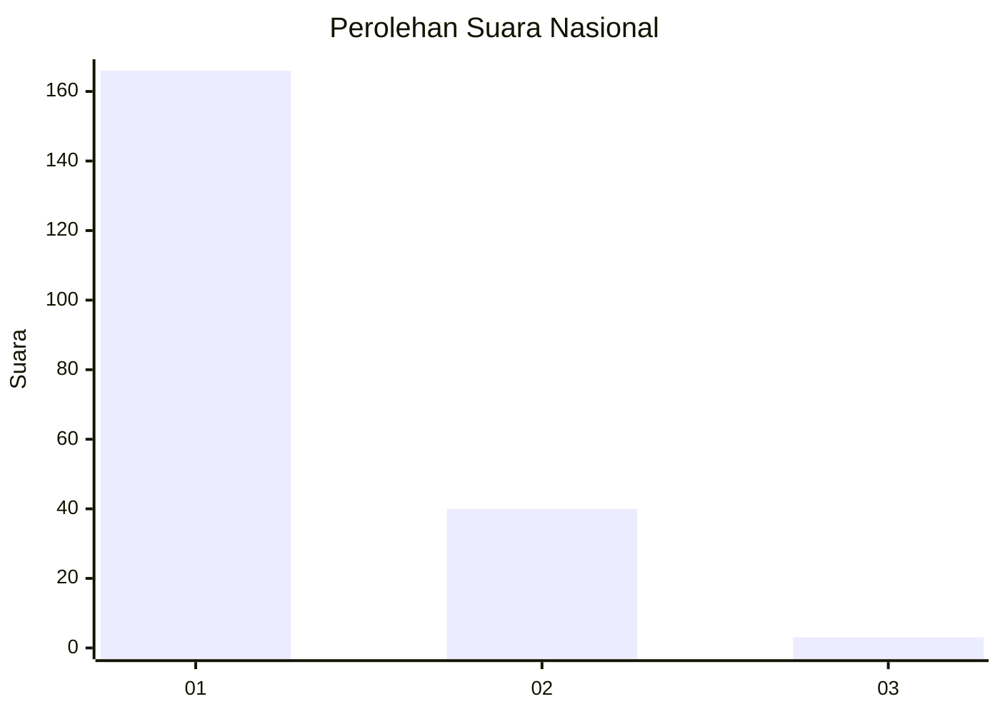
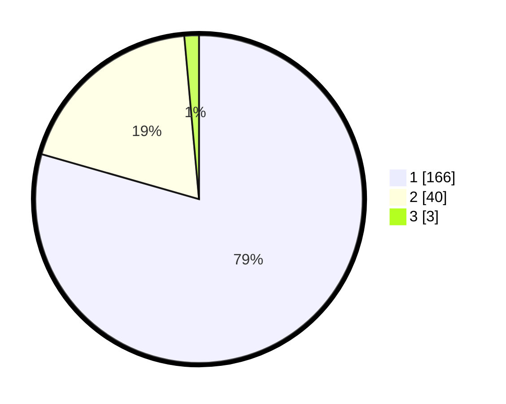

# Hasil

## Grafik

## Tabel

| No. | Nama Paslon    | Suara | Suara (raw) | Persentase |
|:--- |:-------------- | -----:| -----------:| ----------:|
| 1   | ANIES MUHAIMIN | 166   | [166][p-1]  | 79,43      |
| 2   | PRABOWO GIBRAN | 40    | [40][p-2]   | 19,14      |
| 3   | GANJAR MAHFUD  | 3     | [3][p-3]    | 1,44       |

[p-1]: https://github.com/gigit-pemilu/pemilu-2024/blob/main/pilpres/hitung-suara/sub/13-sumatera-barat/sub/77-kota-pariaman/sub/01-pariaman-tengah/sub/2018-pauh-timur/sub/005-tps/sub/paslon-1.txt
[p-2]: https://github.com/gigit-pemilu/pemilu-2024/blob/main/pilpres/hitung-suara/sub/13-sumatera-barat/sub/77-kota-pariaman/sub/01-pariaman-tengah/sub/2018-pauh-timur/sub/005-tps/sub/paslon-2.txt
[p-3]: https://github.com/gigit-pemilu/pemilu-2024/blob/main/pilpres/hitung-suara/sub/13-sumatera-barat/sub/77-kota-pariaman/sub/01-pariaman-tengah/sub/2018-pauh-timur/sub/005-tps/sub/paslon-3.txt

## Foto C Plano

https://sirekap-obj-formc.kpu.go.id/9c73/pemilu/ppwp/13/77/01/20/18/1377012018005-20240215-001846--9eb5aafe-dc37-4f2f-b388-c94e9d8503ab.jpg

https://sirekap-obj-formc.kpu.go.id/9c73/pemilu/ppwp/13/77/01/20/18/1377012018005-20240215-002006--ccc8a093-0646-48f8-9ebb-ae27014988db.jpg

https://sirekap-obj-formc.kpu.go.id/9c73/pemilu/ppwp/13/77/01/20/18/1377012018005-20240215-002118--30f8a85d-ba4c-4310-b922-b1f76efc6208.jpg

## Metadata

| Key        | Value               |
| ---------- | ------------------- |
| Time Stamp | 2024-02-17 09:30:03 |

