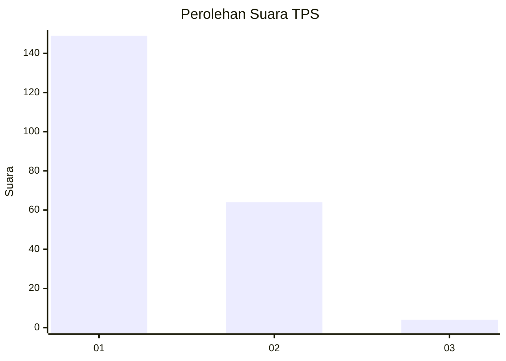
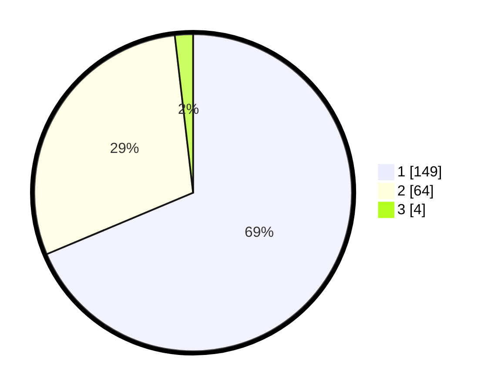

# Hasil

## Grafik

## Tabel

| No. | Nama Paslon    | Suara | Suara (raw) | Persentase |
|:--- |:-------------- | -----:| -----------:| ----------:|
| 1   | ANIES MUHAIMIN | 149   | [149][p-1]  | 68,66      |
| 2   | PRABOWO GIBRAN | 64    | [64][p-2]   | 29,49      |
| 3   | GANJAR MAHFUD  | 4     | [4][p-3]    | 1,84       |

[p-1]: https://github.com/gigit-pemilu/pemilu-2024-13-sumatera-barat/blob/main/pilpres/hitung-suara/sub/13-sumatera-barat/sub/77-kota-pariaman/sub/02-pariaman-utara/sub/2005-ampalu/sub/002-tps/sub/paslon-1.txt
[p-2]: https://github.com/gigit-pemilu/pemilu-2024-13-sumatera-barat/blob/main/pilpres/hitung-suara/sub/13-sumatera-barat/sub/77-kota-pariaman/sub/02-pariaman-utara/sub/2005-ampalu/sub/002-tps/sub/paslon-2.txt
[p-3]: https://github.com/gigit-pemilu/pemilu-2024-13-sumatera-barat/blob/main/pilpres/hitung-suara/sub/13-sumatera-barat/sub/77-kota-pariaman/sub/02-pariaman-utara/sub/2005-ampalu/sub/002-tps/sub/paslon-3.txt

## Foto C Plano

https://sirekap-obj-formc.kpu.go.id/6332/pemilu/ppwp/13/77/02/20/05/1377022005002-20240215-081031--5d4283f7-3732-415d-b551-719c4af16997.jpg

https://sirekap-obj-formc.kpu.go.id/6332/pemilu/ppwp/13/77/02/20/05/1377022005002-20240215-081502--a17bbaf3-9da5-4306-a509-1ffc4e642032.jpg

https://sirekap-obj-formc.kpu.go.id/6332/pemilu/ppwp/13/77/02/20/05/1377022005002-20240215-081814--dbe59453-5615-4d3e-b0be-fec056141f06.jpg

## Metadata

| Key        | Value               |
| ---------- | ------------------- |
| Time Stamp | 2024-02-16 10:30:29 |

