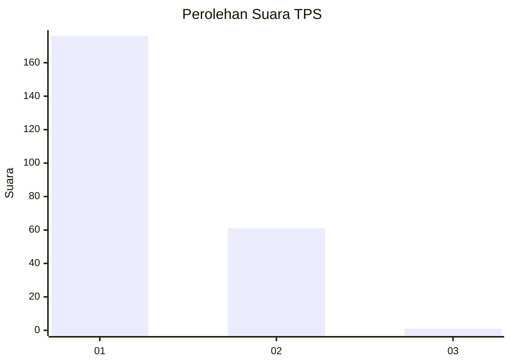
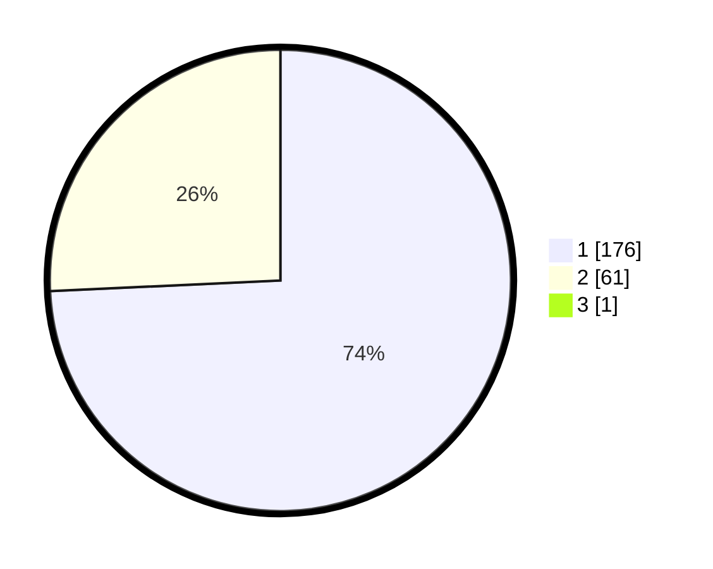

# Hasil

## Grafik

## Tabel

| No. | Nama Paslon    | Suara | Suara (raw) | Persentase |
|:--- |:-------------- | -----:| -----------:| ----------:|
| 1   | ANIES MUHAIMIN | 176   | [176][p-1]  | 73,95      |
| 2   | PRABOWO GIBRAN | 61    | [61][p-2]   | 25,63      |
| 3   | GANJAR MAHFUD  | 1     | [1][p-3]    | 0,42       |

[p-1]: https://github.com/gigit-pemilu/pemilu-2024-13-sumatera-barat/blob/main/pilpres/hitung-suara/sub/13-sumatera-barat/sub/77-kota-pariaman/sub/02-pariaman-utara/sub/2016-balai-naras/sub/002-tps/sub/paslon-1.txt
[p-2]: https://github.com/gigit-pemilu/pemilu-2024-13-sumatera-barat/blob/main/pilpres/hitung-suara/sub/13-sumatera-barat/sub/77-kota-pariaman/sub/02-pariaman-utara/sub/2016-balai-naras/sub/002-tps/sub/paslon-2.txt
[p-3]: https://github.com/gigit-pemilu/pemilu-2024-13-sumatera-barat/blob/main/pilpres/hitung-suara/sub/13-sumatera-barat/sub/77-kota-pariaman/sub/02-pariaman-utara/sub/2016-balai-naras/sub/002-tps/sub/paslon-3.txt

## Foto C Plano

https://sirekap-obj-formc.kpu.go.id/0988/pemilu/ppwp/13/77/02/20/16/1377022016002-20240215-084151--7f6e67b7-fce2-4afa-800d-bc2376dac247.jpg

https://sirekap-obj-formc.kpu.go.id/0988/pemilu/ppwp/13/77/02/20/16/1377022016002-20240215-084403--92e2c60a-8b18-4da8-975c-1dbadefe5320.jpg

https://sirekap-obj-formc.kpu.go.id/0988/pemilu/ppwp/13/77/02/20/16/1377022016002-20240215-084449--a28152e4-5fd2-46f8-93a0-ebebdab08b41.jpg

## Metadata

| Key        | Value               |
| ---------- | ------------------- |
| Time Stamp | 2024-02-16 10:30:29 |

