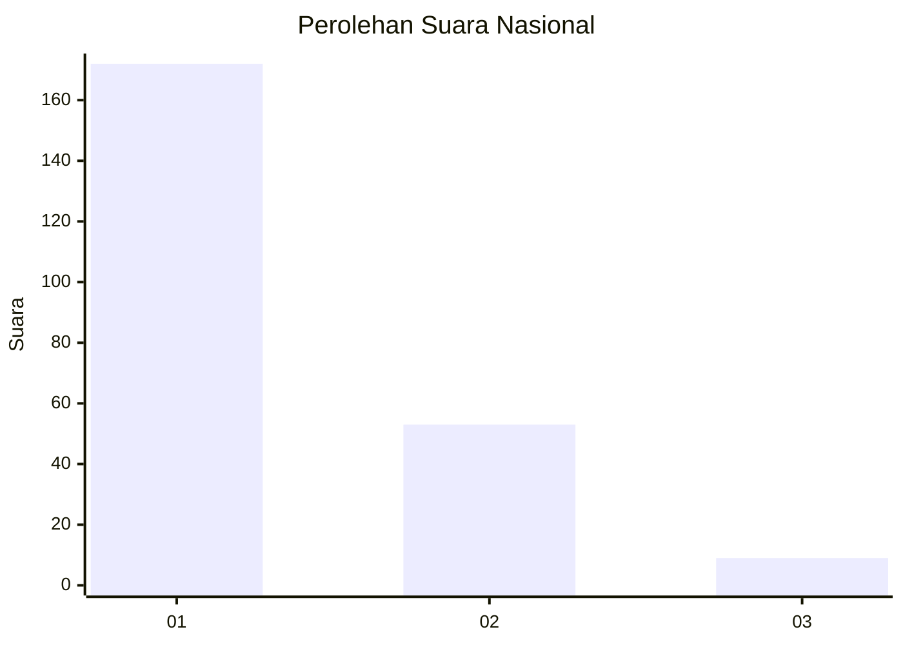
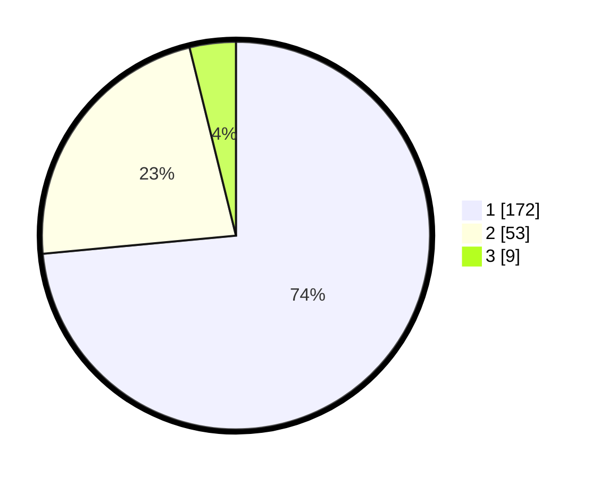

# Hasil

## Grafik

## Tabel

| No. | Nama Paslon    | Suara | Suara (raw) | Persentase |
|:--- |:-------------- | -----:| -----------:| ----------:|
| 1   | ANIES MUHAIMIN | 172   | [172][p-1]  | 73,50      |
| 2   | PRABOWO GIBRAN | 53    | [53][p-2]   | 22,65      |
| 3   | GANJAR MAHFUD  | 9     | [9][p-3]    | 3,85       |

[p-1]: https://github.com/gigit-pemilu/pemilu-2024/blob/main/pilpres/hitung-suara/sub/13-sumatera-barat/sub/77-kota-pariaman/sub/03-pariaman-selatan/sub/2018-taluk/sub/003-tps/sub/paslon-1.txt
[p-2]: https://github.com/gigit-pemilu/pemilu-2024/blob/main/pilpres/hitung-suara/sub/13-sumatera-barat/sub/77-kota-pariaman/sub/03-pariaman-selatan/sub/2018-taluk/sub/003-tps/sub/paslon-2.txt
[p-3]: https://github.com/gigit-pemilu/pemilu-2024/blob/main/pilpres/hitung-suara/sub/13-sumatera-barat/sub/77-kota-pariaman/sub/03-pariaman-selatan/sub/2018-taluk/sub/003-tps/sub/paslon-3.txt

## Foto C Plano

https://sirekap-obj-formc.kpu.go.id/2afe/pemilu/ppwp/13/77/03/20/18/1377032018003-20240215-210307--812ced7c-6edd-4dce-8d22-a85d98dbe64a.jpg

https://sirekap-obj-formc.kpu.go.id/2afe/pemilu/ppwp/13/77/03/20/18/1377032018003-20240215-191313--343729f4-ce59-420a-bd66-39ce8c4e950a.jpg

https://sirekap-obj-formc.kpu.go.id/2afe/pemilu/ppwp/13/77/03/20/18/1377032018003-20240215-191720--4e84f331-3d7d-4e8d-b422-d4016d151c3d.jpg

## Metadata

| Key        | Value               |
| ---------- | ------------------- |
| Time Stamp | 2024-02-16 11:00:29 |

