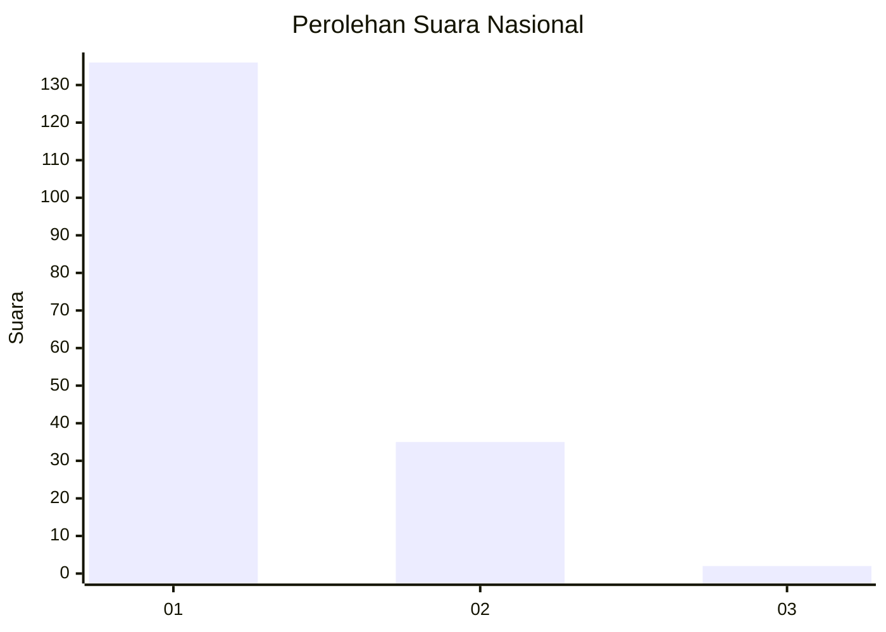
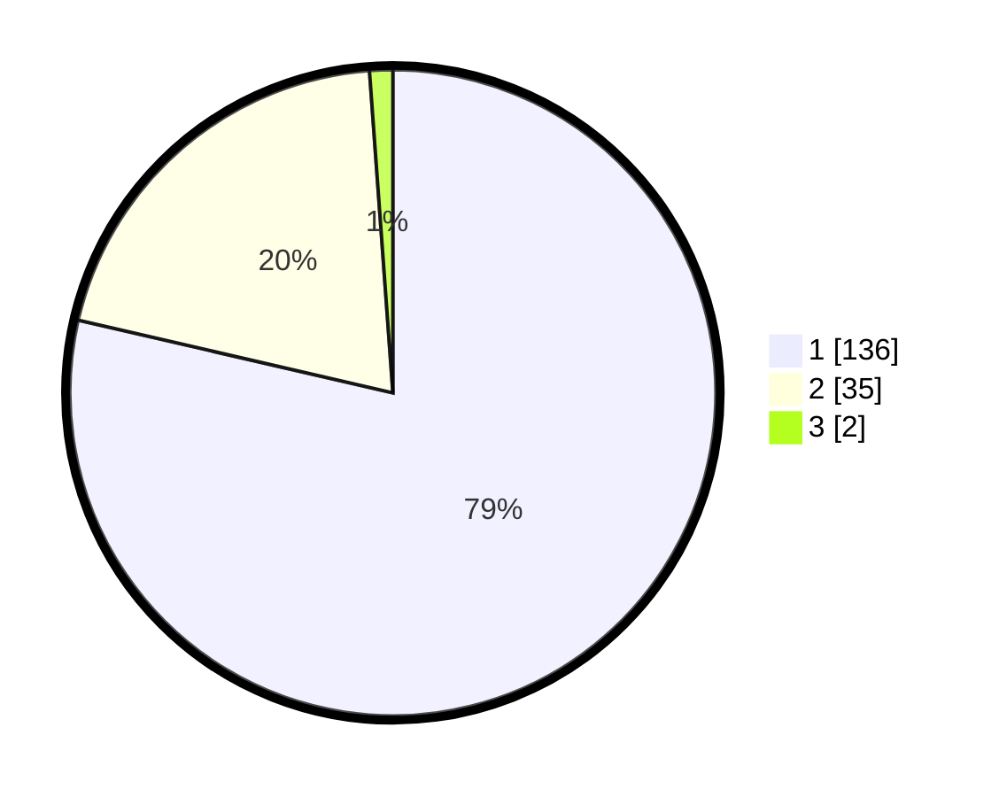

# Hasil

## Grafik

## Tabel

| No. | Nama Paslon    | Suara | Suara (raw) | Persentase |
|:--- |:-------------- | -----:| -----------:| ----------:|
| 1   | ANIES MUHAIMIN | 136   | [136][p-1]  | 78,61      |
| 2   | PRABOWO GIBRAN | 35    | [35][p-2]   | 20,23      |
| 3   | GANJAR MAHFUD  | 2     | [2][p-3]    | 1,16       |

[p-1]: https://github.com/gigit-pemilu/pemilu-2024/blob/main/pilpres/hitung-suara/sub/13-sumatera-barat/sub/77-kota-pariaman/sub/04-pariaman-timur/sub/2002-pakasai/sub/001-tps/sub/paslon-1.txt
[p-2]: https://github.com/gigit-pemilu/pemilu-2024/blob/main/pilpres/hitung-suara/sub/13-sumatera-barat/sub/77-kota-pariaman/sub/04-pariaman-timur/sub/2002-pakasai/sub/001-tps/sub/paslon-2.txt
[p-3]: https://github.com/gigit-pemilu/pemilu-2024/blob/main/pilpres/hitung-suara/sub/13-sumatera-barat/sub/77-kota-pariaman/sub/04-pariaman-timur/sub/2002-pakasai/sub/001-tps/sub/paslon-3.txt

## Foto C Plano

https://sirekap-obj-formc.kpu.go.id/006d/pemilu/ppwp/13/77/04/20/02/1377042002001-20240214-222315--742dc19f-a6b5-4d06-98ba-dd73767c9611.jpg

https://sirekap-obj-formc.kpu.go.id/006d/pemilu/ppwp/13/77/04/20/02/1377042002001-20240214-222048--04bab086-89ff-4618-86d4-99d3f2bbab3f.jpg

## Metadata

| Key        | Value               |
| ---------- | ------------------- |
| Time Stamp | 2024-02-16 11:00:29 |

