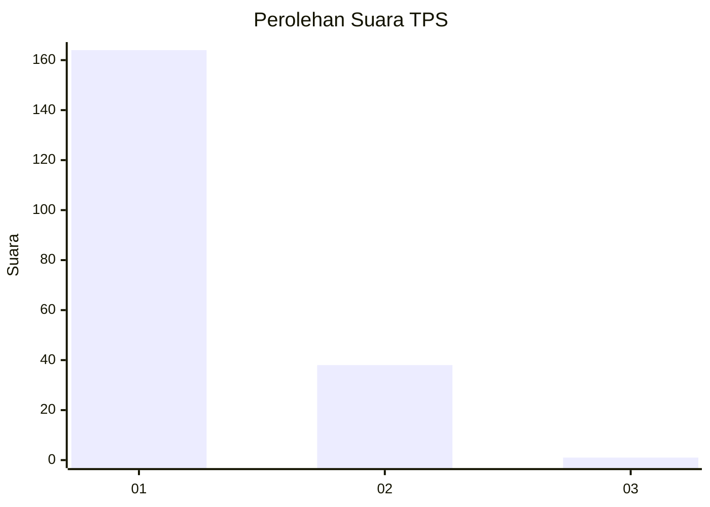
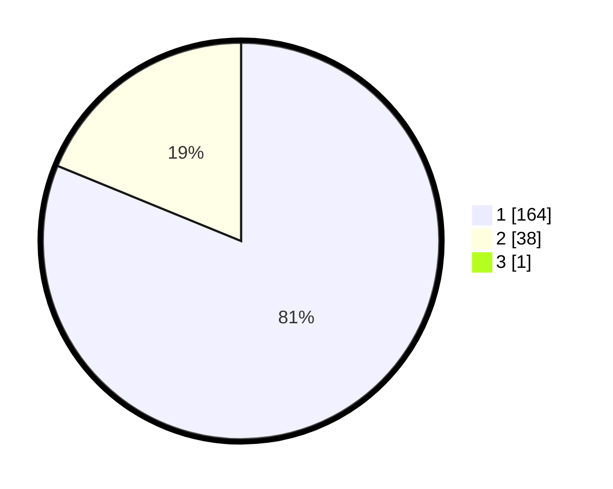

# Hasil

## Grafik

## Tabel

| No. | Nama Paslon    | Suara | Suara (raw) | Persentase |
|:--- |:-------------- | -----:| -----------:| ----------:|
| 1   | ANIES MUHAIMIN | 164   | [164][p-1]  | 80,79      |
| 2   | PRABOWO GIBRAN | 38    | [38][p-2]   | 18,72      |
| 3   | GANJAR MAHFUD  | 1     | [1][p-3]    | 0,49       |

[p-1]: https://github.com/gigit-pemilu/pemilu-2024-13-sumatera-barat/blob/main/pilpres/hitung-suara/sub/13-sumatera-barat/sub/77-kota-pariaman/sub/04-pariaman-timur/sub/2005-koto-marapak/sub/002-tps/sub/paslon-1.txt
[p-2]: https://github.com/gigit-pemilu/pemilu-2024-13-sumatera-barat/blob/main/pilpres/hitung-suara/sub/13-sumatera-barat/sub/77-kota-pariaman/sub/04-pariaman-timur/sub/2005-koto-marapak/sub/002-tps/sub/paslon-2.txt
[p-3]: https://github.com/gigit-pemilu/pemilu-2024-13-sumatera-barat/blob/main/pilpres/hitung-suara/sub/13-sumatera-barat/sub/77-kota-pariaman/sub/04-pariaman-timur/sub/2005-koto-marapak/sub/002-tps/sub/paslon-3.txt

## Foto C Plano

https://sirekap-obj-formc.kpu.go.id/1eb8/pemilu/ppwp/13/77/04/20/05/1377042005002-20240218-203108--b74e1cd5-ec42-4cf7-a80b-ef091bc780d7.jpg

https://sirekap-obj-formc.kpu.go.id/1eb8/pemilu/ppwp/13/77/04/20/05/1377042005002-20240218-203134--0cd40c0a-d612-46f8-b308-6e51345117cb.jpg

https://sirekap-obj-formc.kpu.go.id/1eb8/pemilu/ppwp/13/77/04/20/05/1377042005002-20240218-203204--cf327334-e419-4a3a-8d41-98282d2c386e.jpg

## Metadata

| Key        | Value               |
| ---------- | ------------------- |
| Time Stamp | 2024-02-20 15:00:00 |

