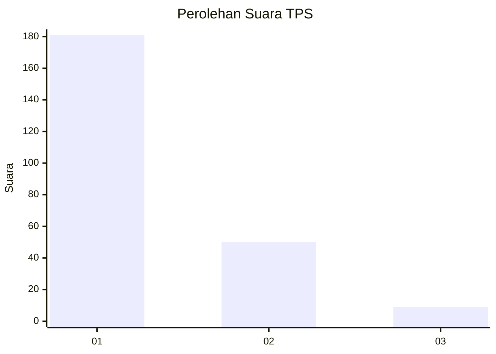
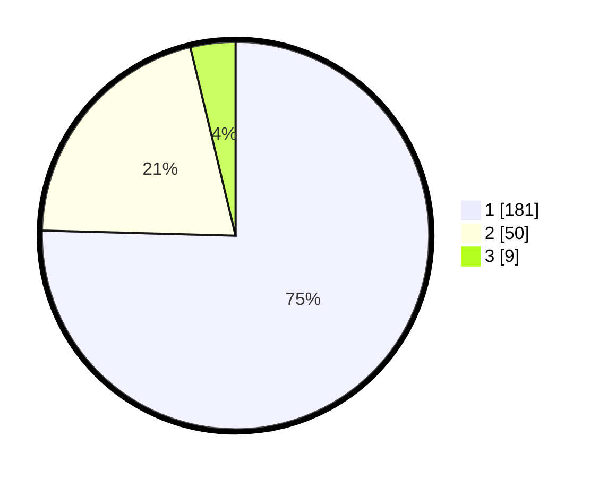

# Hasil

## Grafik

## Tabel

| No. | Nama Paslon    | Suara | Suara (raw) | Persentase |
|:--- |:-------------- | -----:| -----------:| ----------:|
| 1   | ANIES MUHAIMIN | 181   | [181][p-1]  | 75,42      |
| 2   | PRABOWO GIBRAN | 50    | [50][p-2]   | 20,83      |
| 3   | GANJAR MAHFUD  | 9     | [9][p-3]    | 3,75       |

[p-1]: https://github.com/gigit-pemilu/pemilu-2024-13-sumatera-barat/blob/main/pilpres/hitung-suara/sub/13-sumatera-barat/sub/77-kota-pariaman/sub/04-pariaman-timur/sub/2009-cubadak-mentawai/sub/003-tps/sub/paslon-1.txt
[p-2]: https://github.com/gigit-pemilu/pemilu-2024-13-sumatera-barat/blob/main/pilpres/hitung-suara/sub/13-sumatera-barat/sub/77-kota-pariaman/sub/04-pariaman-timur/sub/2009-cubadak-mentawai/sub/003-tps/sub/paslon-2.txt
[p-3]: https://github.com/gigit-pemilu/pemilu-2024-13-sumatera-barat/blob/main/pilpres/hitung-suara/sub/13-sumatera-barat/sub/77-kota-pariaman/sub/04-pariaman-timur/sub/2009-cubadak-mentawai/sub/003-tps/sub/paslon-3.txt

## Foto C Plano

https://sirekap-obj-formc.kpu.go.id/acba/pemilu/ppwp/13/77/04/20/09/1377042009003-20240215-071335--0bad8942-97a1-4533-9daa-507e19ca2023.jpg

https://sirekap-obj-formc.kpu.go.id/acba/pemilu/ppwp/13/77/04/20/09/1377042009003-20240215-071503--55524857-889c-417a-b8c9-b11afcac8bf7.jpg

https://sirekap-obj-formc.kpu.go.id/acba/pemilu/ppwp/13/77/04/20/09/1377042009003-20240215-071618--21256e9a-85e8-4498-b746-5d7eee940a5a.jpg

## Metadata

| Key        | Value               |
| ---------- | ------------------- |
| Time Stamp | 2024-02-16 11:00:29 |

