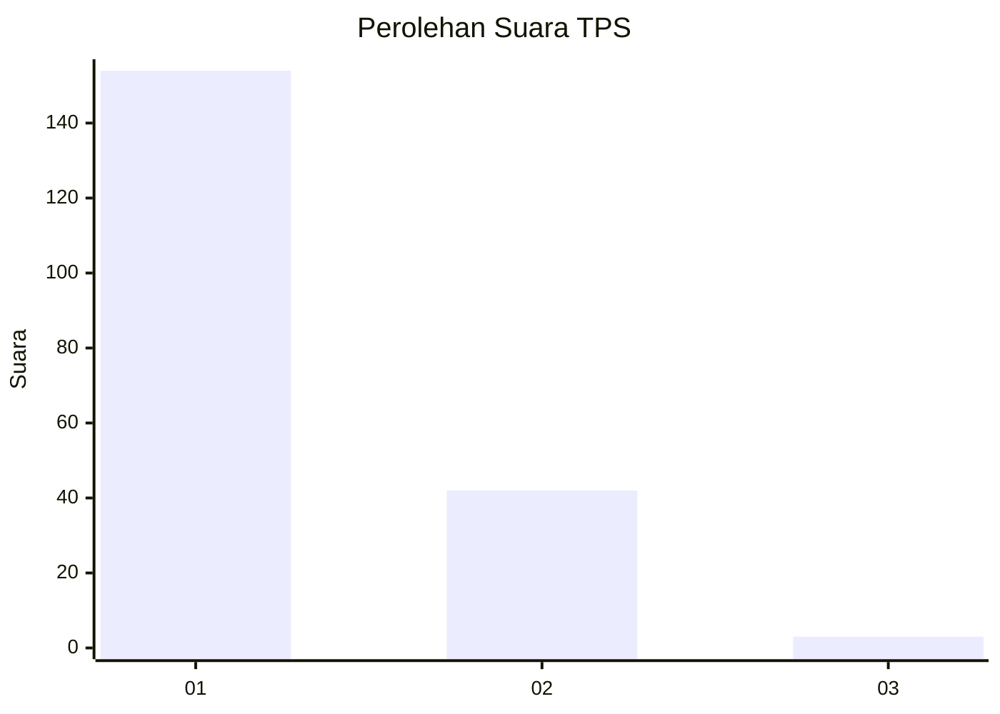
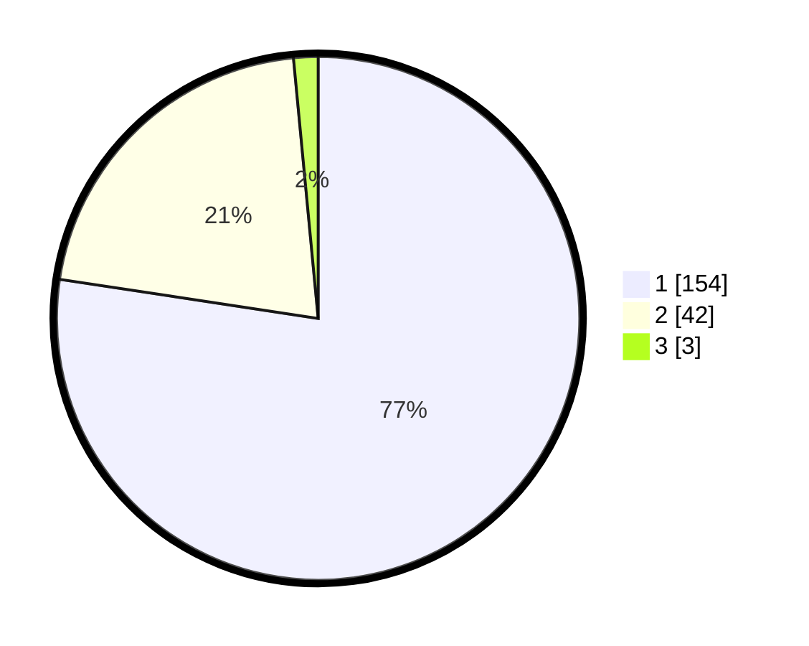

# Hasil

## Grafik

## Tabel

| No. | Nama Paslon    | Suara | Suara (raw) | Persentase |
|:--- |:-------------- | -----:| -----------:| ----------:|
| 1   | ANIES MUHAIMIN | 154   | [154][p-1]  | 77,39      |
| 2   | PRABOWO GIBRAN | 42    | [42][p-2]   | 21,11      |
| 3   | GANJAR MAHFUD  | 3     | [3][p-3]    | 1,51       |

[p-1]: https://github.com/gigit-pemilu/pemilu-2024-13-sumatera-barat/blob/main/pilpres/hitung-suara/sub/13-sumatera-barat/sub/77-kota-pariaman/sub/04-pariaman-timur/sub/2014-kampung-kandang/sub/001-tps/sub/paslon-1.txt
[p-2]: https://github.com/gigit-pemilu/pemilu-2024-13-sumatera-barat/blob/main/pilpres/hitung-suara/sub/13-sumatera-barat/sub/77-kota-pariaman/sub/04-pariaman-timur/sub/2014-kampung-kandang/sub/001-tps/sub/paslon-2.txt
[p-3]: https://github.com/gigit-pemilu/pemilu-2024-13-sumatera-barat/blob/main/pilpres/hitung-suara/sub/13-sumatera-barat/sub/77-kota-pariaman/sub/04-pariaman-timur/sub/2014-kampung-kandang/sub/001-tps/sub/paslon-3.txt

## Foto C Plano

https://sirekap-obj-formc.kpu.go.id/38cb/pemilu/ppwp/13/77/04/20/14/1377042014001-20240215-020338--599edeed-30d7-41d3-97e1-5c52b6fde1e5.jpg

https://sirekap-obj-formc.kpu.go.id/38cb/pemilu/ppwp/13/77/04/20/14/1377042014001-20240215-032631--503bfd46-564b-4bd7-a4cb-fd0f7e1e4b83.jpg

https://sirekap-obj-formc.kpu.go.id/38cb/pemilu/ppwp/13/77/04/20/14/1377042014001-20240215-015824--2df7b5a3-94de-4427-bff4-da9535ba3072.jpg

## Metadata

| Key        | Value               |
| ---------- | ------------------- |
| Time Stamp | 2024-02-16 11:00:29 |

